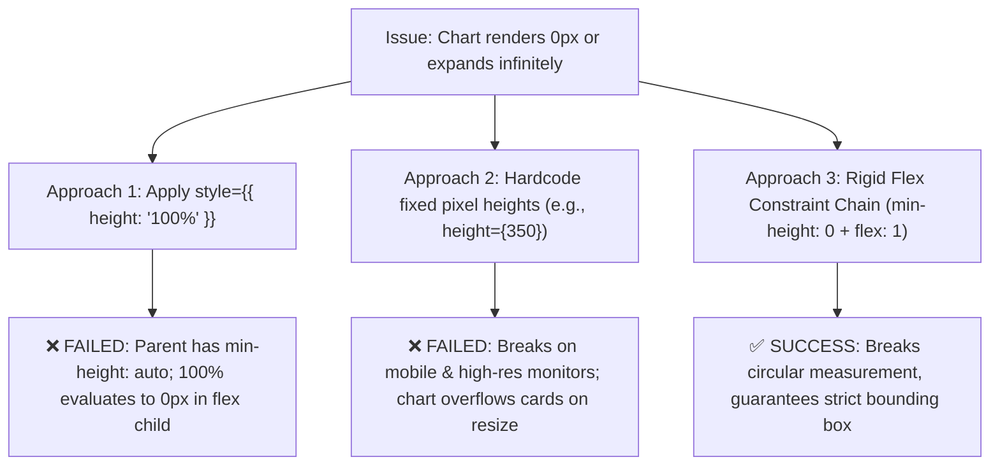
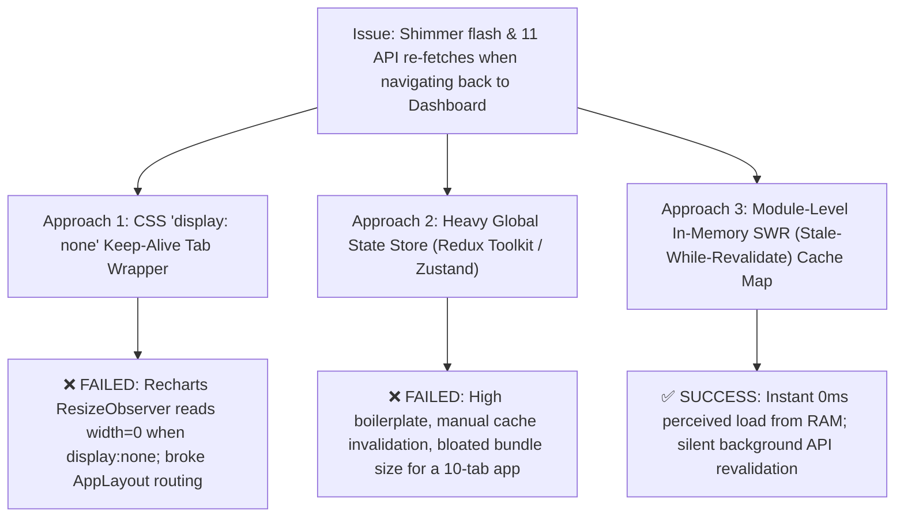
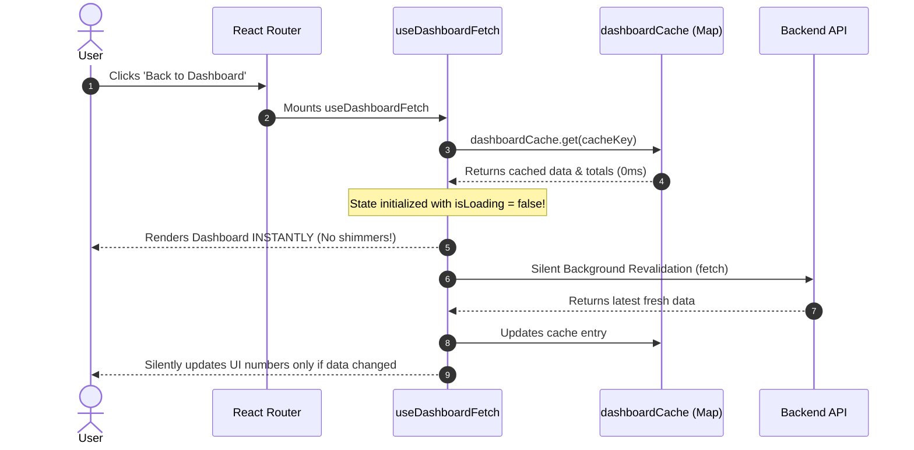
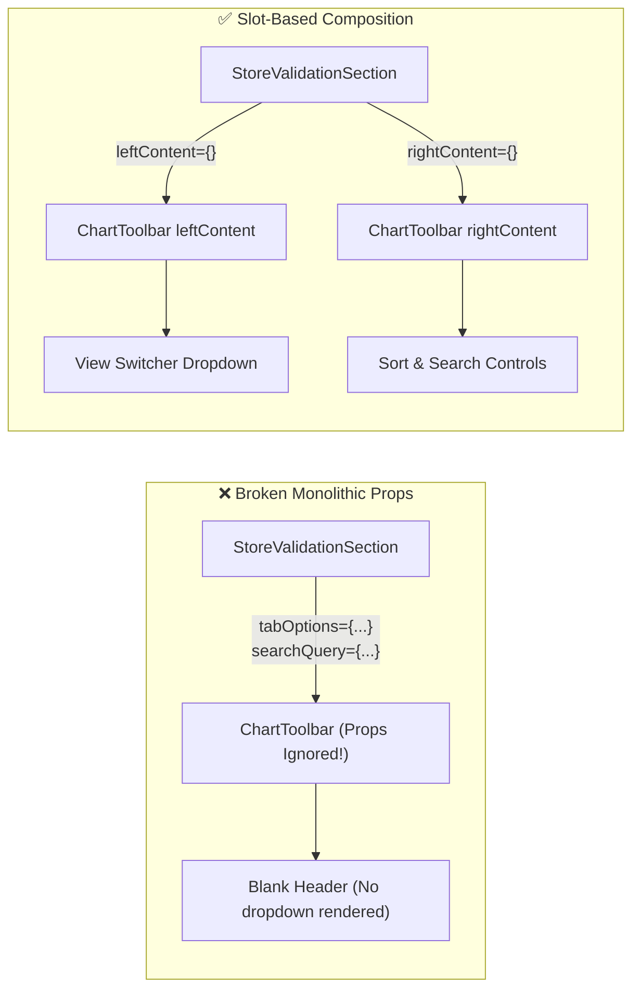
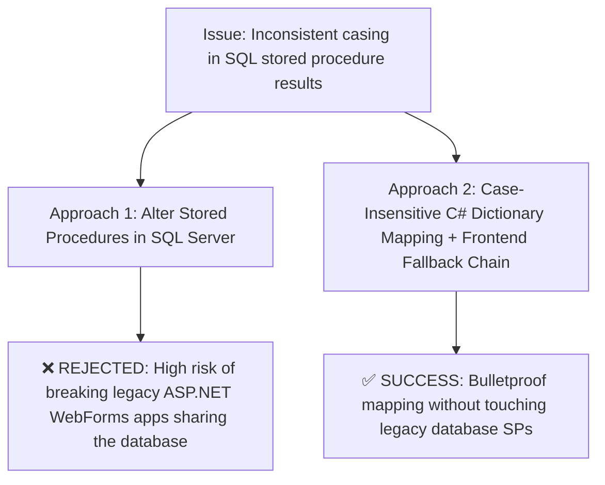

# 🛠️ Problems, Attempted Approaches & Engineering Solutions

This document catalogs the real engineering hurdles encountered during the development of the **Vishal Mega Mart POS Dashboard V2**, detailing the root causes, every approach evaluated or attempted, why certain approaches failed, the final production solution, and visual flowcharts.

---

## 📑 Table of Problems

1. [Problem 1: Recharts SVG 0px Collapse & Responsive Flexbox Sizing](#problem-1-recharts-svg-0px-collapse--responsive-flexbox-sizing)
2. [Problem 2: Full Dashboard Remount & Shimmer Flashing on Back-Navigation](#problem-2-full-dashboard-remount--shimmer-flashing-on-back-navigation)
3. [Problem 3: Missing View-Switcher Dropdown in Store Validation (Slot Mismatch)](#problem-3-missing-view-switcher-dropdown-in-store-validation-slot-mismatch)
4. [Problem 4: SQL Server Column Casing Discrepancies in ADO.NET](#problem-4-sql-server-column-casing-discrepancies-in-adonet)
5. [Problem 5: Empty State Banners vs. Clean SVG Zero-Grid Charts](#problem-5-empty-state-banners-vs-clean-svg-zero-grid-charts)

---

## Problem 1: Recharts SVG 0px Collapse & Responsive Flexbox Sizing

### 🔍 The Symptom
When rendering responsive charts inside flex cards or scrollable containers, charts would either:
1. Render with **0px height or 0px width** (disappearing completely), or
2. Continuously expand to infinity, blowing up the card layout, or
3. Throw console warnings: `The width(0) and height(0) of chart should be greater than 0`.

### 🧠 Root Cause Analysis
Recharts relies on the browser's DOM `getBoundingClientRect()` via `ResizeObserver` inside its `<ResponsiveContainer />`. 
* In CSS Flexbox, a flex child default is `min-height: auto` and `min-width: auto`.
* If a parent flex item does not have a strict, calculable height constraint, `ResponsiveContainer` asks the parent for its height. The parent asks the child for its content height. This creates a circular dependency:
  $$\text{Height} = 0 \iff \text{Parent Height is unconstrained}$$
* If `height: 100%` is applied to a child without an unbroken chain of explicit heights all the way to a block parent, the browser calculates `100% of auto = 0`.

---

### 🧪 Approaches Attempted



#### Approach 1: Inline `height: 100%`
* **What we did:** Added `style={{ height: '100%', width: '100%' }}` on the chart card wrappers.
* **Why it failed:** In CSS flexbox, percentage heights on flex items are undefined unless the parent has an explicit non-flex height. The chart collapsed to `0px × 0px`.

#### Approach 2: Hardcoded Pixel Heights (`height={320}`)
* **What we did:** Removed `ResponsiveContainer` and passed static pixel heights directly into `<BarChart width={600} height={320}>`.
* **Why it failed:** The charts were no longer responsive. On 1366×768 laptop displays, charts clipped off screen; on 4K ultrawide monitors, charts looked tiny and left huge empty white boxes.

#### Approach 3 (The Production Solution): Strict Flex Constraint Chain
* **What we did:** Established an unbroken flex constraint rule across all dashboard CSS:
  1. Parent Card: `display: flex; flex-direction: column;`
  2. Wrapper Container: `flex: 1 1 auto; min-height: 0; min-width: 0; position: relative;`
  3. ResponsiveContainer: Wrapped inside the rigidly constrained `min-height: 0` container.

```css
/* Production Flex Rule in DashboardSection.css */
.cc-card {
  display: flex;
  flex-direction: column;
  min-height: 0;
  width: 100%;
}

.cc-chart-scroll {
  flex: 1 1 auto;
  min-height: 0;
  min-width: 0;
  overflow-y: auto;
  position: relative;
}
```

```jsx
// React Component Implementation
<div className="cc-card">
  <ChartToolbar leftContent="STORE PERFORMANCE" />
  <div className="cc-chart-scroll" style={{ minHeight: '265px', maxHeight: '265px' }}>
    <ResponsiveContainer width="100%" height={chartHeight}>
      <BarChart data={chartData} layout="vertical">
        {/* SVG Elements */}
      </BarChart>
    </ResponsiveContainer>
  </div>
</div>
```

---

## Problem 2: Full Dashboard Remount & Shimmer Flashing on Back-Navigation

### 🔍 The Symptom
A user opens `/dashboard`, and all 10 visual sections fetch data (Live Stock, Cycle Count, Sales, etc.). When the user clicks a store name to drill down into a report page (e.g., `/reports/live-stock` or `/reports/store-grc`), and then clicks **Back to Dashboard**, the entire dashboard unmounts, remounts, and **flashes 10 shimmer loading skeleton boxes simultaneously for 2 to 4 seconds**, even though the data was just fetched 10 seconds ago.

---

### 🧠 Root Cause Analysis
React Router v6 declarative `<Routes>` unmounts the previous page component when navigating away.
```jsx
// AppRoutes.jsx
<Route path="/dashboard" element={<DashboardPage />} />
<Route path="/reports/live-stock" element={<LiveStockReportPage />} />
```
When moving from `/dashboard` to `/reports/live-stock`, `<DashboardPage />` is unmounted and its component state (and each section hook's state) is destroyed from React tree memory. When navigating back, `useDashboardFetch` runs its initial `useState({ isLoading: true, data: [] })`, triggering loading skeletons on every section.

---

### 🧪 Approaches Attempted



#### Approach 1: CSS `display: none` / Keep-Alive Component
* **What we did:** Attempted to keep `<DashboardPage />` always mounted in the background and hide it using CSS `style={{ display: isDashboard ? 'block' : 'none' }}`.
* **Why it failed:** 
  1. Recharts uses `ResizeObserver` to calculate SVG paths. When an element is `display: none`, its bounding box is `0px × 0px`. When made visible again, Recharts failed to recalculate SVG paths properly, resulting in flattened bars.
  2. Interfered with global layout headers, search bars, and URL routing in React Router.

#### Approach 2: Global Redux Toolkit / Zustand State
* **What we did:** Evaluated moving all 11 dashboard API datasets into a global Redux store.
* **Why it failed:** Adding 11 Redux slices, action creators, reducers, and dispatchers added over 800 lines of boilerplate, increased bundle size, and required complex manual cache expiration logic.

#### Approach 3 (The Production Solution): In-Memory SWR Cache Map
* **What we did:** Created a module-level JavaScript `Map` inside `useDashboardData.js`. Because module variables live in browser memory across component mount/unmount lifecycles, data survives route changes.



```javascript
// Module-level cache in src/hooks/useDashboardData.js
const dashboardCache = new Map();

const useDashboardFetch = (apiFn, filterFn, totalsMapper, initialPageSize = API_DEFAULTS.PAGE_SIZE) => {
  const cacheKey = `${apiFn.name}_${searchQuery}_${pageIndex}_${pageSize}`;
  const cached = dashboardCache.get(cacheKey);

  // Initialize directly from cache if available -> 0ms shimmer!
  const [data, setData] = useState(cached ? cached.data : []);
  const [totals, setTotals] = useState(cached ? cached.totals : null);
  const [isLoading, setIsLoading] = useState(!cached); // False if cache exists!
  
  useEffect(() => {
    const fetchData = async () => {
      const response = await apiFn(...);
      // Update state AND cache
      dashboardCache.set(cacheKey, { data: items, totals: computedTotals, timestamp: Date.now() });
      setData(items);
      setIsLoading(false);
    };
    fetchData();
  }, [cacheKey]);
};
```

---

## Problem 3: Missing View-Switcher Dropdown in Store Validation (Slot Mismatch)

### 🔍 The Symptom
In the **Store Validation** section, the main card was displaying only the horizontal bar chart and legend, but the dropdown menu to toggle between **"Received vs Validated"**, **"Validation Progress"**, and **"Wrong HU Distribution"** was completely missing from the screen.

```
+-------------------------------------------------------------+
| [MISSING DROPDOWN]                                 [MISSING]| <- Top Toolbar was completely blank!
|                                                             |
|                   Received HU   Validated HU                |
| HD55 =================================== (126)              |
|      =================================   (125, -6 gap)      |
+-------------------------------------------------------------+
```

---

### 🧠 Root Cause Analysis
During an earlier UI standardization pass, the `ChartToolbar` component was refactored into a **pure two-slot layout component**:
```jsx
// src/components/common/ChartToolbar.jsx
export default function ChartToolbar({ leftContent, rightContent, style }) {
  return (
    <div className="vmm-toolbar-header" style={{ ...style }}>
      <h3 className="vmm-toolbar-title">{leftContent}</h3>
      {rightContent && <div className="vmm-toolbar-controls">{rightContent}</div>}
    </div>
  );
}
```
However, in `StoreValidationSection.jsx`, obsolete props from a legacy design were being passed:
```jsx
// ❌ BROKEN USAGE
<ChartToolbar
  tabOptions={VIEW_OPTIONS}
  activeTab={chartView}
  onTabChange={(view) => setChartView(view)}
  searchQuery={searchFilter}
  sortOptions={sortOptions}
/>
```
Because `ChartToolbar` **only renders `props.leftContent` and `props.rightContent`**, all the props (`tabOptions`, `searchQuery`, `sortOptions`) were silently ignored by React. Since `leftContent` was `undefined`, the toolbar header rendered completely blank!

Additionally, the outer wrapper `<div className="cc-card" style={{ overflow: 'hidden' }}>` had `overflow: hidden`, which would clip dropdown menus even when opened.

---

### 🧪 The Solution



#### Code Fix:
1. Passed `<CustomDropdown options={VIEW_OPTIONS} value={chartView} onChange={setChartView} />` into `leftContent`.
2. Passed the sort dropdown and `ChartSearchInput` into `rightContent`.
3. Removed `style={{ overflow: 'hidden' }}` from `.cc-card` so the dropdown overlay menu renders without being clipped.

```jsx
// ✅ FIXED IMPLEMENTATION in StoreValidationSection.jsx
<div className="cc-card">
  <ChartToolbar
    leftContent={
      <CustomDropdown
        options={VIEW_OPTIONS}
        value={chartView}
        onChange={(val) => {
          setChartView(val);
          const valid = sortOptions.some(o => o.value === sortBy);
          if (!valid) setSortBy(sortOptions[0].value);
        }}
        buttonStyle={{
          backgroundColor: 'transparent',
          border: 'none',
          fontSize: 'inherit',
          fontWeight: 'inherit',
          textTransform: 'uppercase'
        }}
      />
    }
    rightContent={
      <>
        <CustomDropdown
          options={sortOptions}
          value={sortBy}
          onChange={setSortBy}
          prefix="Sort:"
        />
        <ChartSearchInput
          value={searchFilter}
          onChange={setSearchFilter}
          onClear={() => setSearchFilter('')}
          placeholder="Search store..."
        />
      </>
    }
  />
  {/* Legend & Chart Scroll Area */}
</div>
```

---

## Problem 4: SQL Server Column Casing Discrepancies in ADO.NET

### 🔍 The Symptom
Backend API controllers were intermittently returning `null` or `0` for fields that clearly had values in the database, such as `STORE_NAME`, `SYSTEM_STOCK`, or `REF_NO`.

---

### 🧠 Root Cause Analysis
The VMM database uses legacy stored procedures (`SP_NEW_DASHBOARD`, `SP_NEW_REPORT`). Over 15 years of updates by different database teams, column names were aliased with inconsistent casing across different `@status` branches:
* Branch A returned: `Store_Name`, `Store_Code`, `Ref_ID`
* Branch B returned: `STORE_NAME`, `STORE_CODE`, `REF_NO`
* Branch C returned: `store`, `Scanned_Qty`

In C#, standard dictionary lookups `dict["STORE_NAME"]` are **case-sensitive**. A row containing `"Store_Name"` would throw `KeyNotFoundException` or return default values.

---

### 🧪 Approaches Attempted



#### Approach 1: Altering Legacy Stored Procedures in Production
* **Why rejected:** Multiple legacy systems (ASP.NET WebForms POS, handheld Windows CE terminal scanners, nightly batch reporting) actively call `SP_NEW_DASHBOARD`. Renaming output columns in SQL Server would have caused widespread production downtime in physical stores.

#### Approach 2 (The Production Solution): C# Case-Insensitive Mapping & Frontend Fallbacks
1. **Backend ADO.NET Mapping:** All database row readers in `LiveStockService.cs` use `StringComparer.OrdinalIgnoreCase`:
   ```csharp
   var rowDict = new Dictionary<string, object?>(StringComparer.OrdinalIgnoreCase);
   for (int i = 0; i < reader.FieldCount; i++)
   {
       rowDict[reader.GetName(i)] = reader.IsDBNull(i) ? null : reader.GetValue(i);
   }
   ```
2. **Summary OUTPUT Parameters:** Summary statistics (e.g. `@QTY`, `@HU_VALIDATED_QTY`) are extracted from SQL Output Parameters **after** the reader closes, ensuring no result-set confusion.
3. **Frontend Defensive Fallback Chain:**
   ```javascript
   const storeCode = row.STORE_CODE || row.STORE || row.Store_Code || row.Store || '—';
   const storeName = row.STORE_NAME || row.Store_Name || STORE_MAPPING[storeCode] || storeCode;
   ```

---

## Problem 5: Empty State Banners vs. Clean SVG Zero-Grid Charts

### 🔍 The Symptom
When navigating to **Void Dashboard** or **Return Dashboard** on days with zero recorded voids or returns, the dashboard showed a large warning banner:
> **"No Void Data Available"**

The executive design feedback was:
> *"Don't show 'no data available' boxes. Just show the graph and other sections as they are with nothing on it. Don't make an empty state banner."*

---

### 🧠 Root Cause Analysis
Default charting libraries and dashboard templates place an empty state guard:
```jsx
// ❌ Old Guard
if (chartData.length === 0) {
  return <GlobalEmptyState title="No Void Data Available" />;
}
```
In an executive dashboard, replacing a chart card with an error or empty banner destroys visual consistency, shrinks the layout height unexpectedly, and gives the impression that the system failed or is broken. Instead, an empty business metric should simply show a clean, calibrated chart with an empty series ($0$).

---

### 🧪 The Solution

```mermaid
flowchart TD
    DataCheck{"Does chart data have rows?"} -->|Yes| RenderBars["Render BarChart with dynamic data"]
    DataCheck -->|No| CheckEmptyText{"Is emptyText provided?"}
    CheckEmptyText -->|Yes| ShowBanner["Render empty state card"]
    CheckEmptyText -->|No (emptyText='')| RenderZeroGrid["Render BarChart with data={[]} and zero-calibrated CartesianGrid & X/Y Axes"]
```

#### Implementation in `GroupedBarChart.jsx`:
When `emptyText=""` is passed, the component does not render an empty state card; it renders the full `<ResponsiveContainer>` and `<BarChart data={[]}>` with grid lines, axes, and legends intact.

```jsx
// src/components/charts/GroupedBarChart.jsx
if (!data || data.length === 0) {
  if (!emptyText) {
    // Render clean empty SVG chart grid
    return (
      <div style={{ width: '100%', height }}>
        <ResponsiveContainer width="100%" height={height}>
          <BarChart data={[]} margin={{ top: 20, right: 30, left: 0, bottom: 5 }}>
            <CartesianGrid strokeDasharray="3 3" vertical={false} stroke="#e2e8f0" />
            <XAxis dataKey={xKey} tick={{ fontSize: 11, fill: '#64748b' }} axisLine={false} tickLine={false} />
            <YAxis tick={{ fontSize: 11, fill: '#64748b' }} axisLine={false} tickLine={false} />
          </BarChart>
        </ResponsiveContainer>
      </div>
    );
  }
  return <EmptyStateCard text={emptyText} />;
}
```

```jsx
// Section Usage (VoidDashboardSection.jsx & ReturnDashboardSection.jsx)
<GroupedBarChart
  data={chartData}
  xKey="STORE"
  series={[
    { dataKey: 'VOID_QTY', name: 'Void Qty', color: '#ef4444' },
    { dataKey: 'ENCODED_QTY', name: 'Encoded Qty', color: '#3b82f6' }
  ]}
  emptyText="" // Explicit empty string preserves the clean grid!
/>
```

### Result:
* Layout height never collapses.
* KPI cards show `0`, percentages show `0.0%`.
* The chart card retains its full structural framing, preserving a polished, executive aesthetic even on zero-activity days.
