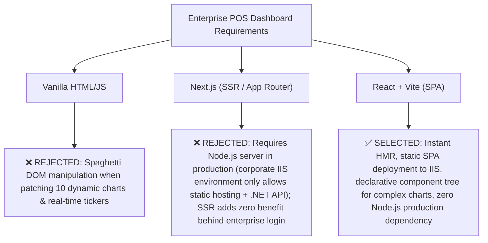
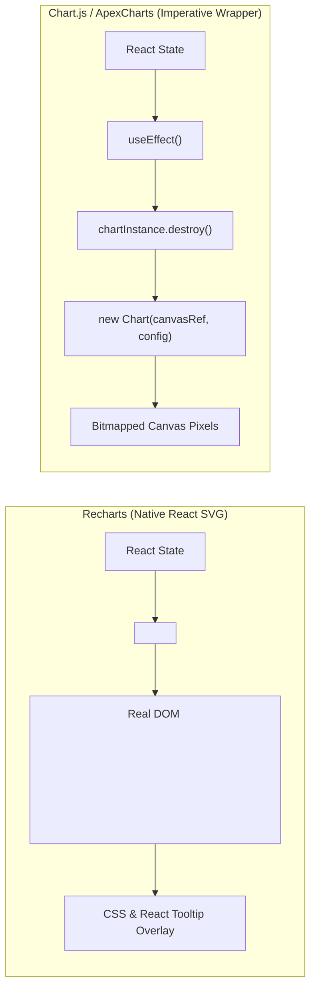
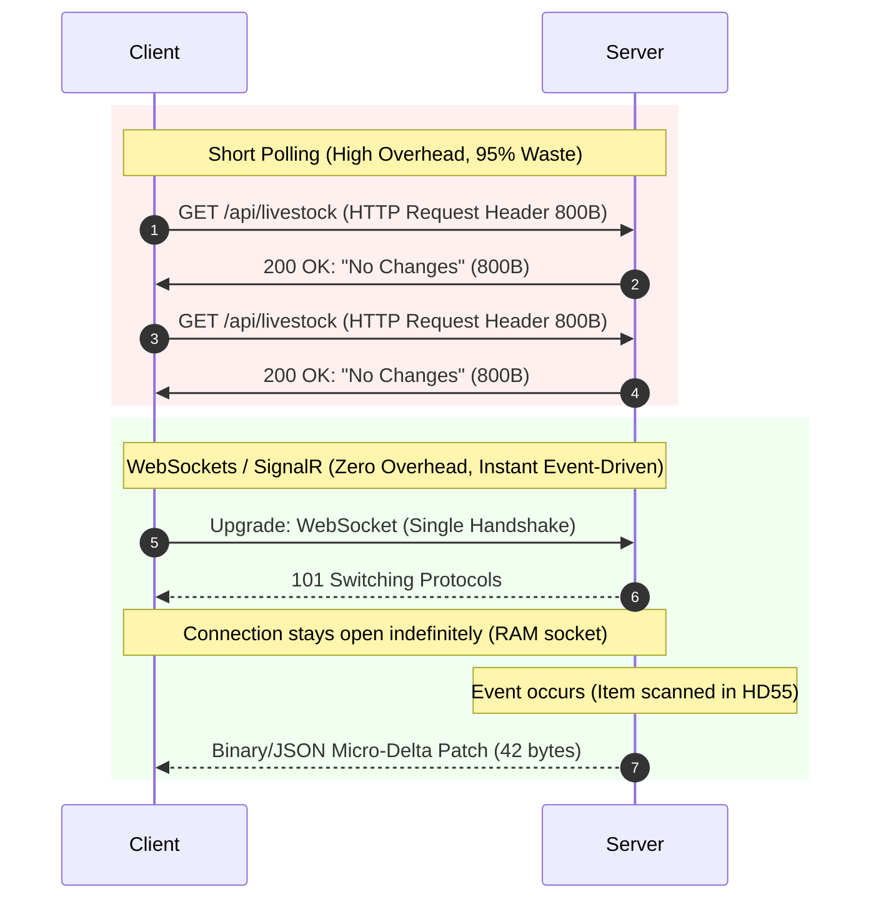
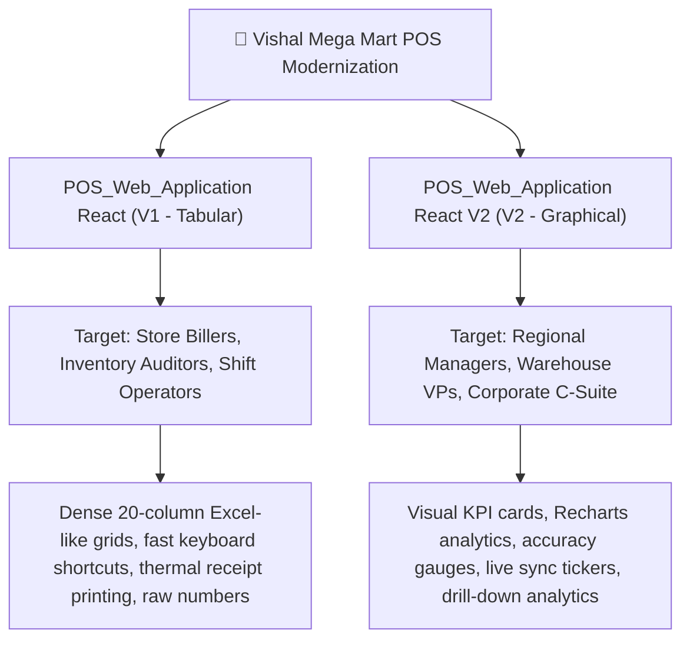
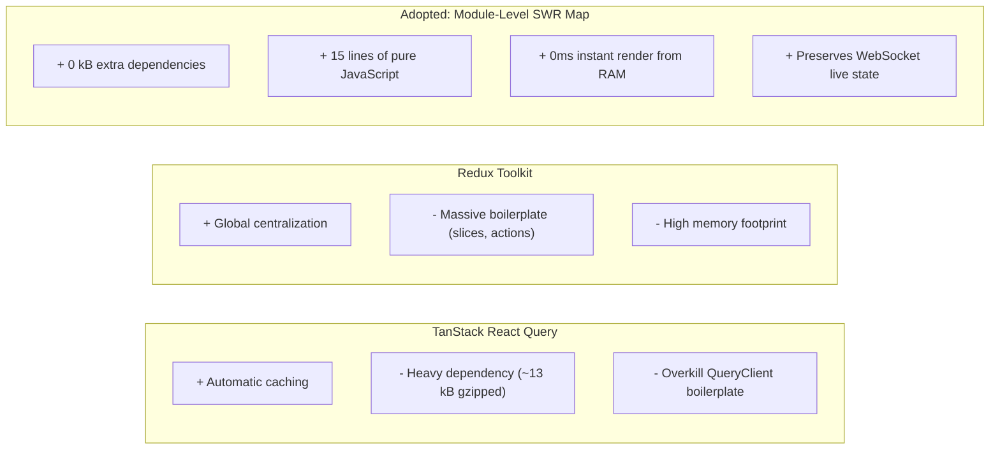

# ❓ Architectural Challenges, Technology Decisions & FAQ

This document provides a comprehensive Question & Answer (Q&A) analysis of the architectural challenges, trade-offs, and technology selections made during the engineering of the **Vishal Mega Mart POS Dashboard V2**.

---

## 📑 Table of Questions

1. [Q1: Why React + Vite instead of Next.js or Vanilla HTML/CSS/JS?](#q1-why-react--vite-instead-of-nextjs-or-vanilla-htmlcssjs)
2. [Q2: Why Recharts instead of Chart.js, D3.js, or ApexCharts?](#q2-why-recharts-instead-of-chartjs-d3js-or-apexcharts)
3. [Q3: Why SignalR / WebSockets instead of HTTP Short Polling or Server-Sent Events (SSE)?](#q3-why-signalr--websockets-instead-of-http-short-polling-or-server-sent-events-sse)
4. [Q4: What was the single most challenging problem in this entire project?](#q4-what-was-the-single-most-challenging-problem-in-this-entire-project)
5. [Q5: Why do we have two separate frontend codebases (Tabular V1 vs. Graphical V2)?](#q5-why-do-we-have-two-separate-frontend-codebases-tabular-v1-vs-graphical-v2)
6. [Q6: Why use an In-Memory SWR Cache instead of Redux Toolkit or React Query (TanStack)?](#q6-why-use-an-in-memory-swr-cache-instead-of-redux-toolkit-or-react-query-tanstack)
7. [Q7: Why do we use Stored Procedures with Output Parameters instead of an ORM (Entity Framework)?](#q7-why-do-we-use-stored-procedures-with-output-parameters-instead-of-an-orm-entity-framework)
8. [Q8: How does the backend prevent SQL Server connection pool exhaustion during 1-second polling?](#q8-how-does-the-backend-prevent-sql-server-connection-pool-exhaustion-during-1-second-polling)
9. [Q9: How does the Role-Based Access Control (RBAC) system function without creating 9 separate APIs?](#q9-how-does-the-role-based-access-control-rbac-system-function-without-creating-9-separate-apis)
10. [Q10: What is the end-to-end deployment architecture and why are ports 5050/5000 and 5999/3000 used?](#q10-what-is-the-end-to-end-deployment-architecture-and-why-are-ports-50505000-and-59993000-used)

---

## Q1: Why React + Vite instead of Next.js or Vanilla HTML/CSS/JS?



### The Alternatives Considered:

1. **Vanilla HTML/CSS/JS:**
   * *Why not?* A dashboard with 10 complex analytical sections, interactive SVG bar charts, sort filters, drill-down modals, and WebSockets requires synchronized UI state. In Vanilla JS, imperative DOM updates (`document.getElementById()`, `innerHTML = ...`) quickly devolve into hard-to-maintain spaghetti code, memory leaks, and DOM desynchronization during rapid real-time updates.
2. **Next.js (Server-Side Rendering):**
   * *Why not?* 
     * **Infrastructure Constraints:** The production environment is Windows Server with IIS (Internet Information Services). Running Next.js requires maintaining a long-running Node.js process (`node server.js`) or Docker containers, which the enterprise IT security policy restricted.
     * **No SEO Needs:** This is an authenticated internal enterprise portal. Public search engine indexing (SEO) is irrelevant.
     * **SSR Overhead with WebSockets:** Real-time dashboards must establish client-side WebSocket connections anyway; pre-rendering charts on a Node server adds server CPU load with zero performance gain for end users.
3. **React + Vite (SPA):**
   * *Why it was chosen:*
     * **Vite:** Blazing fast Hot Module Replacement (HMR) during development (< 50ms) and highly optimized Rollup production bundles.
     * **Static Asset Compilation:** `npm run build` generates pure static HTML, CSS, and JS chunks that can be hosted directly in IIS as a static website without any Node.js runtime.
     * **Declarative React Ecosystem:** Reusable component abstractions (`KpiCard2`, `GroupedBarChart`, `CustomDropdown`) make scaling and maintaining the dashboard seamless.

---

## Q2: Why Recharts instead of Chart.js, D3.js, or ApexCharts?

| Feature | Recharts | Chart.js | D3.js | ApexCharts |
| :--- | :--- | :--- | :--- | :--- |
| **Rendering Engine** | **Native SVG** | HTML5 Canvas | Native SVG / Canvas | SVG |
| **React Integration** | **Native React Components** | Imperative Canvas Wrapper | Imperative DOM manipulation | Wrapper around Vanilla JS |
| **Hover / Crispness** | **Vector Crisp on 4K** | Blurry if canvas not scaled | Vector Crisp | Vector Crisp |
| **Animation Engine** | Spring / Easing built-in | Canvas frame animation | Manual transition math | Built-in |
| **Bundle Overhead** | Moderate (~45 kB tree-shaken) | Moderate | Large (~70 kB) | Heavy (~140 kB) |
| **Custom JSX Tooltips** | **100% Native JSX Elements** | String / Canvas callbacks | Complex manual DOM math | HTML strings |



### Why Recharts Won:
1. **React-First Architecture:** Recharts is built entirely with React components (`<BarChart>`, `<Bar>`, `<XAxis>`). You pass React props and let React reconcile the DOM. There are no imperative `destroy()` or `update()` methods that leak memory.
2. **Native JSX Custom Tooltips:** We needed rich tooltips showing store code, store name, received vs validated quantities, and colored status badges. Recharts allows rendering any standard React component inside `<Tooltip content={<ValidationTooltip />} />`.
3. **SVG Resolution Independence:** Unlike HTML5 Canvas (which gets blurry on Retina or 4K displays if DPI isn't manually scaled), SVG charts scale with mathematical precision at any screen resolution.

---

## Q3: Why SignalR / WebSockets instead of HTTP Short Polling or Server-Sent Events (SSE)?



### Why SignalR / WebSockets:
1. **Bandwidth Efficiency:** With 500 store terminals and corporate managers checking the dashboard, polling 11 endpoints every 2 seconds would generate:
   $$500 \times 11 \times 30 = 165,000\text{ requests per minute!}$$
   This would overwhelm the SQL Server connection pool and IIS thread pool.
2. **True Full-Duplex & Low Latency:** A WebSocket connection remains open. When a worker in warehouse HD55 scans an RFID carton, the database records the scan, the backend poller detects the delta, and sends a 50-byte JSON patch. The UI updates in **under 100 milliseconds**.
3. **Why SignalR over Raw WebSockets?**
   * Raw WebSockets do not have built-in auto-reconnection, exponential backoff, heartbeat pings, or transport negotiation.
   * SignalR handles automatic transport fallback: if a corporate firewall blocks raw WebSockets (port 80/443 inspection), SignalR automatically falls back to Long Polling without breaking the application.

---

## Q4: What was the single most challenging problem in this entire project?

### Answer:
**Synchronizing Real-Time Delta Patches into an In-Memory React State while Maintaining Chart Smoothness.**

### Why it was difficult:
* In typical web development, when new data arrives, you call `setData(newArray)`. 
* But in a dashboard with **vertical bar charts, custom tooltips, sort orders, and search filters**:
  1. If you replace the entire dataset on every WebSocket tick (every 1 second), Recharts triggers full re-entry animations. The bars would constantly flash, jump up and down, and tooltips would close while users were hovering over them.
  2. If the user had typed "HD55" in the search input or sorted by "Highest Pending", an incoming patch could reset their sort order or overwrite their filter.
  3. If a newly scanned store arrived that was not in the initial top 100 list, it had to be smoothly inserted at the top without causing layout displacement.

### How we conquered it:
We implemented an **Immutable Micro-Delta Reducer** inside `useLiveStock`:
```javascript
setData((prev) => {
  let storeFound = false;
  const updated = prev.map((row) => {
    if (row.STORE_CODE === patch.storeCode) {
      storeFound = true;
      return {
        ...row,
        RFID_STOCK: patch.newRfidStock ?? row.RFID_STOCK,
        DIFFERENCE: patch.newDifference ?? row.DIFFERENCE,
        PERCENTAGE: patch.newPercentage ?? row.PERCENTAGE,
        _lastUpdated: Date.now()
      };
    }
    return row;
  });

  // If newly scanned store is not in current view, prepend it smoothly
  if (!storeFound && patch.storeCode) {
    return [createNewStoreRow(patch), ...updated];
  }
  return updated;
});
```
* **Preserved UI Stability:** By mutating only the specific object reference via `prev.map()`, React only re-renders the specific SVG `<rect>` that changed.
* **Row Ticker Animation:** We attached `setHighlightedStore(patch.storeCode)` for 2.5 seconds, giving users a subtle green glow indicating which store just scanned inventory.

---

## Q5: Why do we have two separate frontend codebases (Tabular V1 vs. Graphical V2)?



### The Separation Rationale:
* **The Tabular App (`V1`)** is a strict 1:1 replacement of the legacy ASP.NET WebForms system. Store operators need to view 500 rows at once, copy tabular data to Excel, and verify individual serial numbers. Introducing visual charts into V1 would slow down their data-entry workflow.
* **The Graphical App (`V2`)** is built for operational oversight and management decision-making. Managers don't want to read 500 rows; they want to see **Overall Accuracy (97%)**, **Stores below 80% accuracy**, and **Highest Wrong HU Discrepancies**.
* Keeping the codebases separated ensures changes to the visual dashboard never break mission-critical store billing and audit operations.

---

## Q6: Why use an In-Memory SWR Cache instead of Redux Toolkit or React Query (TanStack)?

### Comparison:



### Why the In-Memory SWR Map Won:
1. **Zero External Dependencies:** No need to install and configure `@tanstack/react-query` or `@reduxjs/toolkit`.
2. **Dead-Simple Code:** A standard JavaScript `new Map()` defined at the file scope of `useDashboardData.js` persists in the browser's JavaScript engine memory for the entire session.
3. **Perfect Synergy with WebSockets:** When SignalR receives patches, it updates the component state directly. A complex cache manager like React Query would fight with the WebSocket patches over who owns the cache.

---

## Q7: Why do we use Stored Procedures with Output Parameters instead of an ORM (Entity Framework)?

### 1. The Legacy Production Schema
The VMM database stores millions of point-of-sale transactions and RFID scans across hundreds of retail stores. Complex aggregations (computing discrepancy between SAP ERP book inventory and physical RFID scans) require intricate SQL queries with temporary tables, index hints, and multi-table joins optimized by the DBA team over a decade.

### 2. Entity Framework Core Bottlenecks
* EF Core LINQ generates dynamic SQL queries that often fail to leverage custom non-clustered indexes or stored procedure query plans cached in SQL Server memory.
* EF Core tracking overhead consumes significant memory when materializing 50,000 stock rows.

### 3. Why OUTPUT Parameters for Summary Stats?
The primary stored procedure `SP_NEW_DASHBOARD` returns summary metrics (`@QTY`, `@HU_VALIDATED_QTY`, `@HU_WRONG_QTY`) as **T-SQL OUTPUT parameters**, rather than a second `SELECT` result set:
```csharp
// C# ADO.NET Extraction
cmd.Parameters.Add(new SqlParameter("@QTY", SqlDbType.Int) { Direction = ParameterDirection.Output });
cmd.Parameters.Add(new SqlParameter("@HU_VALIDATED_QTY", SqlDbType.Int) { Direction = ParameterDirection.Output });

using var reader = await cmd.ExecuteReaderAsync();
// Read grid rows...
reader.Close(); // Output parameters are only populated AFTER the reader is closed!

summary.TotalQty = (int)(cmd.Parameters["@QTY"].Value ?? 0);
summary.ValidatedQty = (int)(cmd.Parameters["@HU_VALIDATED_QTY"].Value ?? 0);
```

---

## Q8: How does the backend prevent SQL Server connection pool exhaustion during 1-second polling?

The background service `DashboardSectionsPollerService.cs` checks the database every second to broadcast real-time patches. If 500 users opened the dashboard, naive polling would spawn 500 database queries every second, causing connection pool exhaustion (`Timeout expired. The timeout period elapsed prior to obtaining a connection from the pool`).

### The 4-Layer Defense Architecture:

```mermaid
flowchart TD
    Timer["PeriodicTimer (1 second tick)"] --> Layer1{"Layer 1: Hub Occupancy Check"}
    Layer1 -->|0 clients connected| Idle["Skip query; poll only once every 60s baseline"]
    Layer1 -->|>= 1 client connected| Layer2["Layer 2: SemaphoreSlim Gate (concurrency = 1)"]
    
    Layer2 --> Layer3["Layer 3: Single DB Query against SP_NEW_DASHBOARD"]
    Layer3 --> Layer4{"Layer 4: In-Memory Snapshot Comparison"}
    
    Layer4 -->|Values match snapshot| NoOp["Discard; Send ZERO packets over network"]
    Layer4 -->|Values differ (delta detected)| Broadcast["Send Micro-Delta to SignalR Clients"]
```

1. **Layer 1 — Hub Occupancy Check:** If `DashboardHub.ConnectedClientsCount == 0`, polling slows from 1 second to 60 seconds.
2. **Layer 2 — Semaphore Concurrency Gate:** `private static readonly SemaphoreSlim _pollerDbGate = new(1, 1);`. Only one thread can execute a database query at any given moment.
3. **Layer 3 — In-Memory Snapshot Cache:** The poller maintains a `ConcurrentDictionary<string, StoreValidationSnapshot>`. If the database returns the exact same numbers as the previous tick, **no SignalR broadcast occurs**. Zero network bandwidth is wasted.

---

## Q9: How does the Role-Based Access Control (RBAC) system function without creating 9 separate APIs?

### The Challenge:
Different users have different operational scopes:
* **Super Admin (Headquarters):** Views all 100+ stores nationally across all 10 dashboard sections.
* **Store Admin (e.g., HD55 Store Manager):** Only allowed to see Live Stock, Cycle Count, Sales, Voids, and Returns for their specific store code (`HD55`).
* **Warehouse Admin (Distribution Center):** Only allowed to see DC Validation, DC Encoding, Tag Management, and Vendor Discrepancies.

### The Solution: Parameter Interception
Instead of building 3 different sets of APIs, we use **Parameter Interception**:
```mermaid
flowchart TD
    Req["Incoming API Request: GET /api/livestock?storeCode=ALL"] --> Auth{"Auth Token / User Type"}
    
    Auth -->|Super Admin| Bypass["Allow storeCode='ALL'; Query entire national database"]
    
    Auth -->|Store Admin (Assigned to HD55)| Intercept["Security Interceptor dynamically overrides storeCode = 'HD55'"]
    
    Auth -->|Warehouse Admin| Intercept2["Security Interceptor restricts queries to Warehouse IDs"]
    
    Bypass --> SQL["Execute Stored Procedure"]
    Intercept --> SQL
    Intercept2 --> SQL
```
* The backend enforces data boundaries at the parameter level.
* The frontend `AuthContext.jsx` uses `hasSection(sectionKey)` to conditionally render only the authorized dashboard cards.

---

## Q10: What is the end-to-end deployment architecture and why are ports 5050/5000 and 5999/3000 used?

### Port Topology:

| Service | Dev Server Port | Production (IIS) Port | Wi-Fi / LAN IP |
| :--- | :--- | :--- | :--- |
| **Backend Web API (.NET 8)** | `5050` / `5000` | `5000` | `http://172.20.204.134:5000` |
| **Frontend UI (React V2)** | `5999` / `5173` | `3000` | `http://172.20.204.134:3000` |

### Zero-Downtime Deployment Scripts:
When running deployment commands (`/deploy-backend`, `/deploy-frontend`, `/deploy-all`):
1. **Frontend:**
   * Automatically toggles the production safety splash screen in `LoginPage.jsx`.
   * Executes `npm run build` targeting `dist/`.
   * Copies assets to `C:\publish_frontend`.
   * Recycles the IIS Application Pool `VMM_Frontend_Pool`.
2. **Backend:**
   * Compiles .NET 8 in `Release` configuration (`dotnet publish -c Release`).
   * Publishes binaries to `C:\publish`.
   * Recycles `VMM_Backend_Pool` without killing active local debugging sessions.
