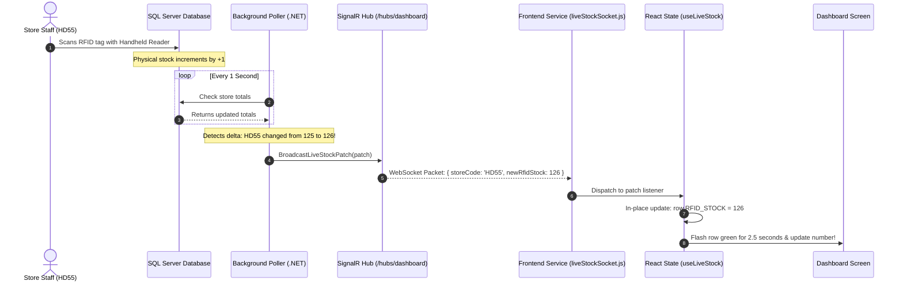

# 🔌 The Beginner's Complete Guide to WebSockets & SignalR

> **Target Audience:** This guide is written so that **any web developer**—even if you only know basic HTML, CSS, and simple JavaScript—can completely understand how real-time communication works from the server to your screen!

---

## 📑 Table of Contents
1. [What is a WebSocket? (The Telephone Analogy)](#1-what-is-a-websocket-the-telephone-analogy)
2. [What is SignalR and Why Do We Use It?](#2-what-is-signalr-and-why-do-we-use-it)
3. [The Big Picture: How Data Moves in VMM](#3-the-big-picture-how-data-moves-in-vmm)
4. [Step-by-Step Backend Code (C# .NET 8)](#4-step-by-step-backend-code-c-net-8)
5. [Step-by-Step Frontend Client (`liveStockSocket.js`)](#5-step-by-step-frontend-client-livestocksocketjs)
6. [How the React Component Updates the Screen](#6-how-the-react-component-updates-the-screen)
7. [Beginner Code Lab: 40-Line Pure HTML/JS WebSocket Ticker](#7-beginner-code-lab-40-line-pure-htmljs-websocket-ticker)

---

## 1. What is a WebSocket? (The Telephone Analogy)

### The Old Way: Standard HTTP (Sending Letters by Postal Mail)
Normally, when your web browser talks to a server, it uses **HTTP (HyperText Transfer Protocol)**:
1. Your browser sends a **Request**: *"Hey server, give me the stock for Store HD55."*
2. The server sends back a **Response**: *"Here is the stock: 125 items."*
3. **The conversation immediately ends! The connection closes.**

```
Browser  ====== Request ======>  Server
Browser  <===== Response ======  Server
            (Connection Closed)
```

**The Problem:** If a store cashier scans 10 more items 5 seconds later, **the server CANNOT tell you**. The server has no phone number to call you back. Your browser has to constantly ask again and again (*"Any new data now? What about now? How about now?"*). This is called **Polling**, and it wastes huge amounts of server power and network bandwidth.

---

### The New Way: WebSockets (A Live Phone Call)
A **WebSocket** opens a two-way, permanent communication channel between your browser and the server.

```
Browser  ====== "Let's open a WebSocket" ======>  Server
Browser  <===== "Agreed! Line is open" =========  Server
--------------------------------------------------------
Browser  <~~~~~ "Cashier just scanned 1 item" ~~  Server (Instant!)
Browser  <~~~~~ "Cashier scanned another item" ~  Server (Instant!)
```

* It is like dialing a phone number and **staying on the line**.
* Whenever anything changes in the database, the server pushes the change down the phone line immediately.
* You do not have to refresh the page or click any button.

---

## 2. What is SignalR and Why Do We Use It?

You might ask: *If WebSockets exist, why do we need SignalR?*

**SignalR** is an open-source library created by Microsoft for .NET and JavaScript that makes WebSockets **super reliable and easy to code**:

| Feature | Raw WebSocket (`new WebSocket()`) | SignalR (`@microsoft/signalr`) |
| :--- | :--- | :--- |
| **If Wi-Fi drops** | Connection dies forever. You must write manual reconnect code. | **Automatically reconnects** with intelligent retry delays! |
| **Corporate Firewalls** | Many company firewalls block raw WebSockets. | Automatically falls back to **Long Polling** so your app never breaks. |
| **Message Format** | You receive raw text/binary strings. You must manually parse JSON. | You call functions by name: `connection.on("ReceiveData", data => ...)` |
| **Rooms & Groups** | You must code client tracking manually. | Built-in store groups (e.g., send message only to "Store_HD55"). |

---

## 3. The Big Picture: How Data Moves in VMM

Here is the exact journey of an RFID scan from a physical store to the dashboard screen:



---

## 4. Step-by-Step Backend Code (C# .NET 8)

Let's look at the actual backend code so you understand what C# is doing.

### Step 4.1: The Hub (`DashboardHub.cs`)
Think of a **Hub** as a central telephone switchboard in your office.

```csharp
using Microsoft.AspNetCore.SignalR;

namespace VS_Mart_Backend.Features.Dashboard.Hubs
{
    // Inheriting from 'Hub' gives us all real-time capabilities
    public class DashboardHub : Hub
    {
        // Tracks how many browsers currently have the dashboard open
        private static int _connectedClients = 0;
        public static int ConnectedClientsCount => Math.Max(0, Volatile.Read(ref _connectedClients));

        // When a user opens the dashboard in their browser
        public override async Task OnConnectedAsync()
        {
            Interlocked.Increment(ref _connectedClients);
            await base.OnConnectedAsync();
        }

        // When a user closes their tab or browser
        public override async Task OnDisconnectedAsync(Exception? exception)
        {
            Interlocked.Decrement(ref _connectedClients);
            await base.OnDisconnectedAsync(exception);
        }

        // Method to send a Live Stock update to ALL open browsers
        public async Task BroadcastLiveStockPatch(LiveStockDeltaPatch patch)
        {
            // "ReceiveLiveStockPatch" is the secret event name the frontend listens for!
            await Clients.All.SendAsync("ReceiveLiveStockPatch", patch);
        }
    }
}
```

---

### Step 4.2: The Background Engine (`DashboardSectionsPollerService.cs`)
This background service runs continuously on the server without needing anyone to press a button.

```csharp
// Runs in the background 24/7
public class DashboardSectionsPollerService : BackgroundService
{
    private readonly IHubContext<DashboardHub> _hubContext;

    protected override async Task ExecuteAsync(CancellationToken stoppingToken)
    {
        // PeriodicTimer fires accurately every 1 second
        using var timer = new PeriodicTimer(TimeSpan.FromSeconds(1));

        while (!stoppingToken.IsCancellationRequested)
        {
            await timer.WaitForNextTickAsync(stoppingToken);

            // 1. SMART CHECK: Don't poll if NO users have the dashboard open!
            if (DashboardHub.ConnectedClientsCount == 0)
            {
                continue; // Sleep and do nothing! Saves server CPU!
            }

            // 2. Query database for latest store stock
            var currentStock = await FetchLatestStockFromDatabaseAsync();

            // 3. Compare with what we saw last second (in-memory snapshot)
            if (currentStock.RfidQty != _previousSnapshot.RfidQty)
            {
                // Create a small patch object with ONLY what changed
                var patch = new LiveStockDeltaPatch
                {
                    StoreCode = "HD55",
                    NewRfidStock = currentStock.RfidQty,
                    NewDifference = currentStock.Difference
                };

                // 4. BLAST the patch down the WebSocket to all connected users!
                await _hubContext.Clients.All.SendAsync("ReceiveLiveStockPatch", patch);
                
                // Update our snapshot
                _previousSnapshot = currentStock;
            }
        }
    }
}
```

---

## 5. Step-by-Step Frontend Client (`liveStockSocket.js`)

Now let's examine the frontend JavaScript. We use the `@microsoft/signalr` npm package.

### Step 5.1: Initializing the Connection
Here is how we configure the connection to connect to our backend hub URL:

```javascript
import * as signalR from '@microsoft/signalr';

class DashboardSocketService {
  constructor() {
    this.connection = null;
    this.patchListeners = new Set(); // Stores our callback functions
    this.statusListeners = new Set();
    this.isConnected = false;
  }

  // Get the backend URL (e.g., http://localhost:5050/hubs/dashboard)
  getHubUrl() {
    const baseUrl = import.meta.env.VITE_API_BASE_URL || 'http://localhost:5000';
    return `${baseUrl}/hubs/dashboard`;
  }

  async connect() {
    // If already connected, do nothing
    if (this.connection && this.isConnected) return;

    // Build the connection object
    this.connection = new signalR.HubConnectionBuilder()
      .withUrl(this.getHubUrl(), {
        // Use WebSockets first; fall back to Long Polling if firewalls block WebSockets
        transport: signalR.HttpTransportType.WebSockets | signalR.HttpTransportType.LongPolling
      })
      // AUTOMATIC RECONNECT with smart delay
      .withAutomaticReconnect({
        nextRetryDelayInMilliseconds: retryContext => {
          // If tried more than 10 times, stop
          if (retryContext.previousRetryCount >= 10) return null;
          // Stagger retries: 2s, 4s, 8s, 15s, 30s
          const delays = [2000, 4000, 8000, 15000, 30000];
          return delays[Math.min(retryContext.previousRetryCount, delays.length - 1)];
        }
      })
      .build();

    // ─── LISTEN FOR SERVER EVENTS ─────────────────────────────
    // When backend says "ReceiveLiveStockPatch", this function runs!
    this.connection.on('ReceiveLiveStockPatch', (patch) => {
      // Notify all React components that are listening
      this.patchListeners.forEach(callback => callback(patch));
    });

    // Start the connection
    try {
      await this.connection.start();
      this.isConnected = true;
      console.log('✅ Connected to Dashboard WebSocket Hub!');
    } catch (err) {
      console.error('❌ Connection failed:', err);
    }
  }

  // Allow React components to subscribe to updates
  onPatch(callback) {
    this.patchListeners.add(callback);
    // Return an unsubscribe function
    return () => {
      this.patchListeners.delete(callback);
    };
  }
}

// Export a single shared instance (Singleton Pattern)
export const liveStockSocket = new DashboardSocketService();
```

---

## 6. How the React Component Updates the Screen

In `src/hooks/useDashboardData.js`, here is how React catches the patch and updates the screen without reloading:

```javascript
export const useLiveStock = () => {
  const [data, setData] = useState([]); // Stores the list of stores
  const [highlightedStore, setHighlightedStore] = useState(null);

  useEffect(() => {
    // 1. Connect to the socket
    liveStockSocket.connect();

    // 2. Register our listener
    const unsubscribe = liveStockSocket.onPatch((patch) => {
      console.log("⚡ Received live patch from server:", patch);

      // 3. Update the specific store in our state array
      setData((previousRows) => {
        return previousRows.map((row) => {
          // If this row is the store that just changed:
          if (row.STORE_CODE === patch.storeCode) {
            return {
              ...row,
              RFID_STOCK: patch.newRfidStock,
              DIFFERENCE: patch.newDifference,
              _lastUpdated: Date.now()
            };
          }
          // Otherwise, return the row untouched
          return row;
        });
      });

      // 4. Highlight this store with a green glow for 2.5 seconds
      setHighlightedStore(patch.storeCode);
      setTimeout(() => {
        setHighlightedStore(null);
      }, 2500);
    });

    // 5. Cleanup when component unmounts
    return () => {
      unsubscribe();
    };
  }, []);

  return { data, highlightedStore };
};
```

---

## 7. Beginner Code Lab: 40-Line Pure HTML/JS WebSocket Ticker

Want to see how simple this really is without any React or frameworks? 
You can save the code below into an `index.html` file on your computer and double-click to open it in Chrome!

```html
<!DOCTYPE html>
<html lang="en">
<head>
  <meta charset="UTF-8">
  <title>Minimal WebSocket Demo</title>
  <style>
    body { font-family: sans-serif; display: flex; justify-content: center; align-items: center; height: 100vh; background: #0f172a; color: white; }
    .card { background: #1e293b; padding: 30px; border-radius: 16px; text-align: center; border: 1px solid #334155; }
    .number { font-size: 64px; font-weight: bold; color: #38bdf8; transition: all 0.3s ease; }
    .flash { color: #4ade80; transform: scale(1.1); }
  </style>
</head>
<body>

  <div class="card">
    <h2>HD55 Scanned RFID Stock</h2>
    <div id="stockCounter" class="number">125</div>
    <p id="status" style="color: #94a3b8;">Connecting to server...</p>
  </div>

  <script>
    const counter = document.getElementById('stockCounter');
    const status = document.getElementById('status');

    // 1. Open the WebSocket connection
    // (Using a free public echo test socket for demonstration)
    const socket = new WebSocket('wss://echo.websocket.events');

    socket.onopen = () => {
      status.innerText = "🟢 Connected live!";
      status.style.color = "#4ade80";

      // Simulate the backend server sending a scan every 3 seconds
      setInterval(() => {
        let currentNum = parseInt(counter.innerText, 10);
        socket.send(JSON.stringify({ newStock: currentNum + 1 }));
      }, 3000);
    };

    // 2. Receive a live message from the server
    socket.onmessage = (event) => {
      const data = JSON.parse(event.data);
      
      // Update the number on screen
      counter.innerText = data.newStock;

      // Add green flash animation
      counter.classList.add('flash');
      setTimeout(() => counter.classList.remove('flash'), 500);
    };

    socket.onclose = () => {
      status.innerText = "🔴 Disconnected";
      status.style.color = "#ef4444";
    };
  </script>
</body>
</html>
```

### Summary of What You Learned:
1. **HTTP** is request/response (one-and-done).
2. **WebSockets** are continuous, two-way open connections.
3. **SignalR** handles auto-reconnection, network fallback, and makes listening for events as simple as `connection.on("EventName", callback)`.
4. In React, we catch the event inside `useEffect`, update our state with `setData(prev => prev.map(...))`, and the screen smoothly re-renders the changed number instantly!
