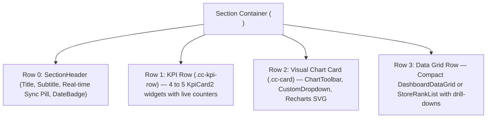

# 🎨 Frontend Architecture, Components & UI Design System Handbook

This document provides a developer guide to the **UI Design System**, core component architecture, and CSS styling standards used across **POS Web Application React V2**.

---

## 📑 Table of Contents
1. [The 3-Row Dashboard Layout Pattern](#1-the-3-row-dashboard-layout-pattern)
2. [Component Catalog & Usage Guidelines](#2-component-catalog--usage-guidelines)
3. [Deep Dive: Building a Production Custom Dropdown from Scratch](#3-deep-dive-building-a-production-custom-dropdown-from-scratch)
4. [Deep Dive: The Two-Slot ChartToolbar Pattern](#4-deep-dive-the-two-slot-charttoolbar-pattern)
5. [The Indian Number System Standard (`en-IN`)](#5-the-indian-number-system-standard-en-in)
6. [CSS Design Tokens, Color Palettes & Responsive Flex Rules](#6-css-design-tokens-color-palettes--responsive-flex-rules)

---

## 1. The 3-Row Dashboard Layout Pattern

Every dashboard section (Live Stock, Cycle Count, Store Validation, Sales, Voids, Returns, DC Validation, etc.) follows the strict **3-Row Architectural Pattern**:



### Why this pattern is mandatory:
* **Cognitive Hierarchy:** Executives see high-level totals at a glance (Row 1), visual trends and distributions in the middle (Row 2), and detailed store-by-store breakdown at the bottom (Row 3).
* **Zero Layout Shifts:** Consistent heights across all tabs eliminate UI jumping when switching between sections.

---

## 2. Component Catalog & Usage Guidelines

ALL visual sections in the V2 Dashboard MUST use the reusable components from `src/components/common/` and `src/components/charts/`:

| Component | File Path | Purpose |
| :--- | :--- | :--- |
| **`SectionHeader`** | `src/components/common/SectionHeader.jsx` | Consistent title, subtitle, live SignalR status pill, and date badge. |
| **`KpiCard2`** | `src/components/charts/KpiCard2.jsx` | Metric card with animated number ticker, status badge, and background icon. |
| **`ChartToolbar`** | `src/components/common/ChartToolbar.jsx` | Two-slot header for chart cards (`leftContent` = view dropdown, `rightContent` = sort + search). |
| **`CustomDropdown`** | `src/components/common/CustomDropdown.jsx` | Pure-CSS custom dropdown with outside click handling. |
| **`GroupedBarChart`** | `src/components/charts/GroupedBarChart.jsx` | Recharts SVG wrapper for side-by-side or stacked comparative bars. |
| **`DashboardDataGrid`** | `src/components/charts/DashboardDataGrid.jsx` | High-density data table with store hover tooltips and report drill-downs. |
| **`StoreRankList`** | `src/components/charts/StoreRankList.jsx` | Compact ranked list of stores with colored discrepancy badges. |

---

## 3. Deep Dive: Building a Production Custom Dropdown from Scratch

In enterprise web applications, using heavy UI libraries (like Material UI or React Select) introduces large bundle bloat (~80 kB) and makes overriding styles difficult. 

In VMM V2, we engineered `CustomDropdown.jsx` in **under 75 lines of pure React and CSS** without a single external library.

### Full Source Code & Line-by-Line Breakdown:

```jsx
import React, { useState, useRef, useEffect } from 'react';
import './CustomDropdown.css';

export default function CustomDropdown({ 
  options,       // Array of { value: 'grouped', label: 'Received vs Validated' }
  value,         // Currently selected value
  onChange,      // Callback function when user selects an option
  prefix,        // Optional prefix text (e.g. "Sort:")
  buttonStyle,   // Custom CSS for trigger button
  menuStyle,     // Custom CSS for dropdown overlay menu
  width          // Optional custom width
}) {
  // 1. Tracks whether the dropdown menu is open or closed
  const [isOpen, setIsOpen] = useState(false);

  // 2. Ref attached to outer wrapper to detect clicks outside
  const containerRef = useRef(null);

  // 3. OUTSIDE CLICK LISTENER: Closes dropdown if user clicks anywhere outside!
  useEffect(() => {
    if (!isOpen) return;

    const handleClickOutside = (e) => {
      // If click target is NOT inside our dropdown container, close it!
      if (containerRef.current && !containerRef.current.contains(e.target)) {
        setIsOpen(false);
      }
    };

    // Attach listener to entire document
    document.addEventListener('mousedown', handleClickOutside);
    
    // ALWAYS remove listener when dropdown closes or unmounts (prevents memory leaks!)
    return () => {
      document.removeEventListener('mousedown', handleClickOutside);
    };
  }, [isOpen]);

  // Find the friendly label of the currently selected option
  const selectedOption = options.find(opt => opt.value === value);
  const displayLabel = selectedOption ? selectedOption.label : value;

  return (
    <div 
      ref={containerRef} 
      className="custom-dropdown-container"
      style={{ position: 'relative', width: width || 'auto' }}
    >
      {/* TRIGGER BUTTON */}
      <button 
        type="button"
        className="ls-filter-select"
        style={{ paddingRight: '24px', width: '100%', textAlign: 'left', ...buttonStyle }}
        onClick={() => setIsOpen(!isOpen)}
      >
        {prefix && <span style={{ color: '#94a3b8', marginRight: '6px' }}>{prefix}</span>}
        {displayLabel}
      </button>

      {/* POPUP MENU */}
      {isOpen && (
        <div 
          className="ls-dropdown-menu" 
          style={{ ...menuStyle, minWidth: '100%', maxHeight: '180px', overflowY: 'auto' }}
        >
          {options.map((opt) => (
            <div 
              key={opt.value}
              className={`ls-dropdown-item ${value === opt.value ? 'active' : ''}`}
              onClick={() => { 
                onChange(opt.value); // Tell parent component value changed!
                setIsOpen(false);    // Close menu!
              }}
            >
              {opt.label}
            </div>
          ))}
        </div>
      )}
    </div>
  );
}
```

---

## 4. Deep Dive: The Two-Slot ChartToolbar Pattern

To prevent prop-drilling and maintain uniform spacing across all cards, `ChartToolbar.jsx` uses the **Two-Slot Composition Pattern**:

```jsx
// src/components/common/ChartToolbar.jsx
export default function ChartToolbar({ leftContent, rightContent, style }) {
  return (
    <div className="vmm-toolbar-header" style={{ minHeight: '40px', position: 'relative', zIndex: 20, ...style }}>
      <h3 className="vmm-toolbar-title" style={{ display: 'flex', alignItems: 'center' }}>
        {leftContent}
      </h3>
      {rightContent && (
        <div className="vmm-toolbar-controls">
          {rightContent}
        </div>
      )}
    </div>
  );
}
```

### How to use it in any chart card:
```jsx
<ChartToolbar
  leftContent={
    <CustomDropdown
      options={VIEW_OPTIONS}
      value={chartView}
      onChange={setChartView}
    />
  }
  rightContent={
    <>
      <CustomDropdown
        options={SORT_OPTIONS}
        value={sortBy}
        onChange={setSortBy}
        prefix="Sort:"
      />
      <ChartSearchInput
        value={searchFilter}
        onChange={setSearchFilter}
        onClear={() => setSearchFilter('')}
        placeholder="Search store..."
      />
    </>
  }
/>
```

---

## 5. The Indian Number System Standard (`en-IN`)

Because Vishal Mega Mart operates in India, all numbers representing quantities, sales figures, and inventory **MUST** be formatted using the Indian numbering grouping system (Lakhs and Crores: $12,34,567$ instead of Western Millions $1,234,567$).

### Standard Syntax:
```javascript
// ✅ Correct Indian Formatting:
const formattedStock = Number(value || 0).toLocaleString('en-IN');

// Example Outputs:
// 1000      -> "1,000"
// 100000    -> "1,00,000"     (1 Lakh)
// 10000000  -> "1,00,00,000"  (1 Crore)
```

In every component, always guard against `null` or `undefined` by coercing to `Number(val || 0)`.

---

## 6. CSS Design Tokens, Color Palettes & Responsive Flex Rules

### 🎨 Color Palette Tokens
All colors are curated to ensure high contrast, accessible text, and modern visual aesthetics:

```css
:root {
  /* Brand Primaries */
  --vmm-primary: #1d4ed8;       /* Deep Vibrant Blue */
  --vmm-primary-hover: #1e3a8a; /* Dark Royal Navy */
  --vmm-primary-light: #eff6ff; /* Soft Ice Blue */

  /* Text & Surfaces */
  --vmm-text-dark: #0f172a;     /* Slate 900 */
  --vmm-text-muted: #64748b;    /* Slate 500 */
  --vmm-border: #f1f5f9;        /* Slate 100 */
  --vmm-card-bg: #ffffff;

  /* Metric Status Colors */
  --vmm-success: #10b981;       /* Emerald Green */
  --vmm-warning: #f59e0b;       /* Amber */
  --vmm-danger: #ef4444;        /* Crimson Red */
  --vmm-purple: #8b5cf6;        /* Violet */
}
```

### 📐 Strict Flexbox Chart Rule
When rendering responsive charts (especially with Recharts) inside flex containers, you MUST pass flex constraints down the DOM tree to prevent collapsing or infinite expansion:
1. **Flex Chain:** The parent card/wrapper must have `display: flex; flex-direction: column`.
2. **Scroll Containers:** Any scrollable wrapper inside the flex container MUST use `flex: 1 1 auto; min-height: 0; min-width: 0`.
3. **Avoid `height: 100%` alone:** Never rely solely on `height: 100%` for a chart wrapper inside a flex item, as it will evaluate to 0px.
4. **Recharts ResponsiveContainer:** Ensure `ResponsiveContainer` is wrapped in a rigidly constrained `flex: 1; min-height: 0` container.
