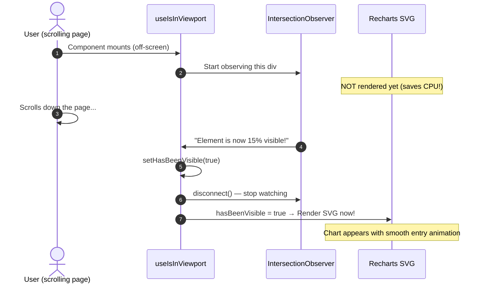

# 🪝 React Hooks Masterclass — Real Examples from the VMM Codebase

> **Target Audience:** This guide takes every React hook used in this project and explains it with the **actual production code** from the VMM V2 codebase. If you understand this document, you understand 95% of modern React.

---

## 📑 Table of Contents
1. [useState — Managing Component State](#1-usestate--managing-component-state)
2. [useEffect — Side Effects & Lifecycle](#2-useeffect--side-effects--lifecycle)
3. [useCallback — Memoized Functions (Preventing Recreations)](#3-usecallback--memoized-functions-preventing-recreations)
4. [useMemo — Memoized Computations (Expensive Calculations)](#4-usememo--memoized-computations-expensive-calculations)
5. [useRef — Persistent Values Without Re-Renders](#5-useref--persistent-values-without-re-renders)
6. [useNavigate (React Router) — Programmatic Navigation](#6-usenavigate-react-router--programmatic-navigation)
7. [Custom Hooks — Building Your Own (useIsInViewport)](#7-custom-hooks--building-your-own-useisinviewport)
8. [The Golden Rules of React Hooks](#8-the-golden-rules-of-react-hooks)

---

## 1. `useState` — Managing Component State

### What It Does
`useState` creates a variable that **React watches**. Whenever you change this variable, React automatically re-renders the component to show the updated value on screen.

### Syntax
```javascript
const [currentValue, setCurrentValue] = useState(initialValue);
//      ↑ read this        ↑ call this to change it       ↑ starting value
```

### Real Example: Chart View Switcher
From [`StoreValidationSection.jsx`](../src/pages/Dashboard/sections/StoreValidationSection.jsx):
```javascript
// Create a state variable called 'chartView' starting with 'grouped'
const [chartView, setChartView] = useState('grouped');
const [searchFilter, setSearchFilter] = useState('');
const [sortBy, setSortBy] = useState('PENDING_DESC');

// Later, when user selects a dropdown option:
<CustomDropdown
  options={VIEW_OPTIONS}
  value={chartView}
  onChange={(val) => setChartView(val)} // Updates state → React re-renders → new chart appears!
/>
```

### How It Differs from a Regular Variable
```javascript
// ❌ Regular variable — React does NOT watch this. Screen will never update.
let chartView = 'grouped';
chartView = 'progress'; // Screen stays the same. React doesn't know this changed!

// ✅ useState — React watches this. Screen updates instantly.
const [chartView, setChartView] = useState('grouped');
setChartView('progress'); // React re-renders the component with the new chart!
```

### Functional Updates (Reading Previous State)
When the new value depends on the old value, always use the **functional form**:
```javascript
// From useDashboardData.js — safely increment a trigger counter
const [refreshTrigger, setRefreshTrigger] = useState(0);

// ✅ Correct: functional update reads the latest value, even in async code
const refresh = () => setRefreshTrigger(prev => prev + 1);

// ❌ Dangerous: if called twice quickly, both reads the SAME stale value
const refresh = () => setRefreshTrigger(refreshTrigger + 1);
```

---

## 2. `useEffect` — Side Effects & Lifecycle

### What It Does
`useEffect` lets you run code **after React has finished rendering**. It's how you:
- Fetch data from APIs
- Start WebSocket connections
- Set up timers or event listeners
- Clean up resources when a component is removed

### Syntax
```javascript
useEffect(() => {
  // This code runs AFTER render

  return () => {
    // This cleanup code runs BEFORE the next effect, or when the component unmounts
  };
}, [dependency1, dependency2]); // Only re-run if these values changed
```

### Real Example 1: Fetching Dashboard Data
From [`useDashboardData.js`](../src/hooks/useDashboardData.js):
```javascript
useEffect(() => {
  // 1. Create an AbortController (to cancel the request if user navigates away)
  const controller = new AbortController();

  const fetchData = async () => {
    setIsLoading(true);
    try {
      // 2. Call the API with the abort signal
      const response = await apiFn(searchQuery, pageIndex, pageSize, controller.signal);
      
      // 3. If the request was cancelled (user left the page), stop here
      if (controller.signal.aborted) return;

      // 4. Update state with the new data
      setData(response.items || []);
      setIsLoading(false);
    } catch (err) {
      // 5. Don't show errors for intentionally aborted requests
      if (err.name === 'AbortError') return;
      setError("Unable to load data.");
    }
  };

  // 6. Debounce search queries by 300ms
  const timer = setTimeout(() => fetchData(), searchQuery ? 300 : 0);

  // 7. CLEANUP: Cancel everything when dependencies change or component unmounts!
  return () => {
    clearTimeout(timer);
    controller.abort(); // Cancel the API request in-flight!
  };
}, [searchQuery, pageIndex, pageSize]); // Re-run whenever these values change
```

### The Dependency Array Explained
```javascript
// Run ONCE when component mounts (like window.onload)
useEffect(() => { ... }, []);

// Run EVERY TIME the component re-renders (usually a bad idea!)
useEffect(() => { ... }); // No array = runs on every render

// Run whenever searchQuery OR pageIndex changes
useEffect(() => { ... }, [searchQuery, pageIndex]);
```

### Real Example 2: Outside Click Detection
From [`CustomDropdown.jsx`](../src/components/common/CustomDropdown.jsx):
```javascript
useEffect(() => {
  // Only attach listener when dropdown is open
  if (!isOpen) return;

  const handleClickOutside = (e) => {
    // If click is NOT inside our dropdown, close it
    if (containerRef.current && !containerRef.current.contains(e.target)) {
      setIsOpen(false);
    }
  };

  // Add listener to the entire page
  document.addEventListener('mousedown', handleClickOutside);

  // CLEANUP: Remove listener when dropdown closes or component unmounts
  return () => {
    document.removeEventListener('mousedown', handleClickOutside);
  };
}, [isOpen]); // Only re-run when isOpen changes
```

> **⚠️ Why cleanup matters:** Without the cleanup function, every time you open the dropdown, a NEW listener gets added to the document. After 100 opens, you'd have 100 dead listeners stacking up = **memory leak!**

---

## 3. `useCallback` — Memoized Functions (Preventing Recreations)

### What It Does
In JavaScript, every time a component re-renders, all functions inside it are **recreated** from scratch. This is usually fine, but if you pass a function as a prop to a child component wrapped in `React.memo`, the child will re-render unnecessarily because it sees a "new" function reference every time.

`useCallback` says: *"Don't recreate this function unless its dependencies change."*

### Syntax
```javascript
const memoizedFunction = useCallback(() => {
  // function body
}, [dependency1]); // Only create a new function when dependencies change
```

### Real Example: Navigation Handler
From [`StoreValidationSection.jsx`](../src/pages/Dashboard/sections/StoreValidationSection.jsx):
```javascript
// Without useCallback: a NEW function object is created every render cycle
// This would cause MemoizedValidationChart to re-render even when data hasn't changed!

// ✅ With useCallback: the same function reference is reused across re-renders
const handleCellClick = useCallback((row, status) => {
  const storeCode = row?.STORE || row?.Store_Code;
  if (!storeCode) return;

  navigate('/reports/grc', {
    state: {
      store: storeCode,
      grcStatus: String(status)
    }
  });
}, [navigate]); // Only recreate if the navigate function itself changes (it almost never does)

// Now this memoized chart won't re-render unless chartData or handleCellClick truly changes
<MemoizedValidationChart chartData={chartData} onCellClick={handleCellClick} />
```

---

## 4. `useMemo` — Memoized Computations (Expensive Calculations)

### What It Does
`useMemo` caches the **result** of an expensive calculation and only recalculates when the inputs change.

### Syntax
```javascript
const computedValue = useMemo(() => {
  // Expensive computation here
  return result;
}, [input1, input2]); // Only recompute when inputs change
```

### Real Example: Filtering, Sorting & Slicing 100 Store Rows
From [`StoreValidationSection.jsx`](../src/pages/Dashboard/sections/StoreValidationSection.jsx):
```javascript
// This computation runs on 100 store rows: filter → sort → return
// Without useMemo, this runs on EVERY keystroke, mouse hover, tooltip open, etc.
const chartData = useMemo(() => {
  if (!data || data.length === 0) return [];
  let result = [...data]; // Create a copy (never mutate the original!)

  // Filter by search
  if (searchFilter.trim()) {
    const term = searchFilter.toLowerCase();
    result = result.filter(row =>
      (row.STORE && row.STORE.toLowerCase().includes(term)) ||
      (row.STORE_NAME && row.STORE_NAME.toLowerCase().includes(term))
    );
  }

  // Sort
  if (sortBy === 'PENDING_DESC') {
    result.sort((a, b) => Number(b.STORE_PENDING_QTY || 0) - Number(a.STORE_PENDING_QTY || 0));
  } else if (sortBy === 'VALIDATED_ASC') {
    result.sort((a, b) => Number(a.HU_VALIDATED_QTY || 0) - Number(b.HU_VALIDATED_QTY || 0));
  }

  return result;
}, [data, searchFilter, sortBy]);
// ↑ Only recomputes when data, searchFilter, or sortBy actually change
// Hovering over a tooltip, opening a dropdown, etc. = zero recomputation!
```

### `useMemo` vs `useCallback`
```javascript
// useMemo caches a VALUE (result of a computation)
const sortedList = useMemo(() => data.sort(...), [data]);

// useCallback caches a FUNCTION (the function object itself)
const handleClick = useCallback(() => navigate('/page'), [navigate]);
```

---

## 5. `useRef` — Persistent Values Without Re-Renders

### What It Does
`useRef` creates a container (`{ current: value }`) that:
1. **Persists across re-renders** (unlike regular variables which reset).
2. **Does NOT trigger a re-render** when changed (unlike `useState`).

### Use Case 1: Tracking First Render (Skip Initial Animation)
From [`LiveTickerValue.jsx`](../src/components/common/LiveTickerValue.jsx):
```javascript
// We want digits to appear instantly on first load, but ANIMATE on updates
const isFirstRender = useRef(true);
const prevNumRef = useRef(null);

useEffect(() => {
  prevNumRef.current = rawNum; // Silently store the number (no re-render!)
  if (isFirstRender.current) {
    isFirstRender.current = false; // Mark first render as done
  }
}, [rawNum]);

// On first render: digits appear instantly
// On subsequent updates: digits roll with animation
const shouldAnimate = !isFirstRender.current;
```

### Use Case 2: DOM Element Reference (Outside Click Detection)
From [`CustomDropdown.jsx`](../src/components/common/CustomDropdown.jsx):
```javascript
const containerRef = useRef(null);
// Attach ref to the DOM element
<div ref={containerRef} className="custom-dropdown-container">

// Now containerRef.current IS the actual HTML DOM element!
// We can check if a click happened inside or outside of it:
if (containerRef.current && !containerRef.current.contains(e.target)) {
  setIsOpen(false); // Click was outside → close dropdown
}
```

### Use Case 3: Tracking Data Presence (Smart Loading State)
From [`useDashboardData.js`](../src/hooks/useDashboardData.js):
```javascript
const hasDataRef = useRef(false);

// On first fetch: show full loading shimmer
// On subsequent refreshes: show subtle refresh indicator instead
if (!hasDataRef.current) {
  setIsLoading(true);   // Full shimmer skeleton
} else {
  setIsRefreshing(true); // Subtle refresh spinner
}

// After data arrives:
if (items.length > 0) {
  hasDataRef.current = true; // Silent flag — no re-render needed
}
```

---

## 6. `useNavigate` (React Router) — Programmatic Navigation

### What It Does
`useNavigate` from React Router v6 lets you navigate to another page **from JavaScript code** (e.g., when a user clicks a chart bar or a table row).

### Real Example: Drill-Down from Dashboard Chart to Report Page
From [`StoreValidationSection.jsx`](../src/pages/Dashboard/sections/StoreValidationSection.jsx):
```javascript
import { useNavigate } from 'react-router-dom';

const navigate = useNavigate();

// When user clicks a bar in the chart:
const handleCellClick = useCallback((row, status) => {
  const storeCode = row?.STORE;

  // Navigate to the GRC Report page with pre-filled filters!
  navigate('/reports/grc', {
    state: {
      store: storeCode,
      fromDate: '2026-09-12',
      toDate: '2026-09-12',
      grcStatus: String(status) // '0' = Wrong, '1' = Validated, '3' = Pending
    }
  });
}, [navigate]);
```

The report page reads these values using `useLocation()`:
```javascript
import { useLocation } from 'react-router-dom';

const location = useLocation();
const prefilledStore = location.state?.store;      // 'HD55'
const prefilledStatus = location.state?.grcStatus; // '0'
```

---

## 7. Custom Hooks — Building Your Own (`useIsInViewport`)

### What Is a Custom Hook?
A custom hook is a regular function that starts with `use` and calls other hooks inside. It lets you **extract and reuse logic** across multiple components.

### Real Example: Lazy-Loading Charts Only When Scrolled Into View
From [`useIsInViewport.js`](../src/hooks/useIsInViewport.js):

**The Problem:** The dashboard has 10 sections. If all 10 sections render their heavy Recharts SVG charts simultaneously on page load, the browser freezes for 500ms+.

**The Solution:** Don't render a chart until the user **scrolls it into view**.

```javascript
import { useState, useEffect, useCallback } from 'react';

export function useIsInViewport(options = { rootMargin: '0px', threshold: 0.15 }) {
  const [hasBeenVisible, setHasBeenVisible] = useState(false); // Has this element ever been seen?
  const [node, setNode] = useState(null); // The DOM element we're watching

  // Callback ref pattern: React calls this with the DOM element
  const ref = useCallback((element) => {
    if (element !== null) {
      setNode(element);
    }
  }, []);

  useEffect(() => {
    if (!node || hasBeenVisible) return; // Already visible? Nothing to do.

    // IntersectionObserver = browser API that fires when an element enters the viewport
    const observer = new IntersectionObserver(([entry]) => {
      if (entry.isIntersecting) {
        setHasBeenVisible(true); // Flag: this element is now visible!
        observer.disconnect();    // Stop watching (we only need to detect it once)
      }
    }, options);

    observer.observe(node); // Start watching the DOM element

    return () => observer.disconnect(); // Cleanup
  }, [node, hasBeenVisible]);

  return [ref, hasBeenVisible]; // Return the ref to attach AND the visibility flag
}
```

### How Components Use It:
```jsx
const MemoizedValidationChart = React.memo(({ chartData }) => {
  const [ref, hasBeenVisible] = useIsInViewport();

  return (
    <div ref={ref} style={{ minHeight: 220 }}>
      {hasBeenVisible && (
        // Only render the heavy chart SVG AFTER user scrolls here!
        <ResponsiveContainer width="100%" height={300}>
          <BarChart data={chartData}>
            {/* ... */}
          </BarChart>
        </ResponsiveContainer>
      )}
    </div>
  );
});
```



---

## 8. The Golden Rules of React Hooks

### Rule 1: Only Call Hooks at the Top Level
```javascript
// ❌ WRONG: Hook inside an if-statement
if (isLoggedIn) {
  const [name, setName] = useState('');
}

// ✅ CORRECT: Hook at the top, condition inside
const [name, setName] = useState('');
if (isLoggedIn) {
  // use name here
}
```

### Rule 2: Only Call Hooks Inside React Functions
```javascript
// ❌ WRONG: Hook in a regular utility function
function formatDate(date) {
  const [formatted, setFormatted] = useState(''); // CRASH!
}

// ✅ CORRECT: Hook in a React component or custom hook
function DateDisplay({ date }) {
  const [formatted, setFormatted] = useState('');
  // ...
}
```

### Rule 3: Always Include ALL Dependencies in the Array
```javascript
// ❌ WRONG: Missing 'searchQuery' in dependency array
useEffect(() => {
  fetchData(searchQuery); // Uses searchQuery but doesn't list it!
}, []); // Bug: fetchData will always use the FIRST searchQuery, never updating

// ✅ CORRECT: Include everything the effect reads
useEffect(() => {
  fetchData(searchQuery);
}, [searchQuery]); // Re-runs whenever searchQuery changes
```

### Rule 4: Always Clean Up Side Effects
```javascript
// ❌ WRONG: Timer is never cleaned up → memory leak
useEffect(() => {
  const interval = setInterval(() => checkStatus(), 5000);
  // Missing cleanup!
}, []);

// ✅ CORRECT: Cleanup stops the timer when component unmounts
useEffect(() => {
  const interval = setInterval(() => checkStatus(), 5000);
  return () => clearInterval(interval); // Cleanup!
}, []);
```
