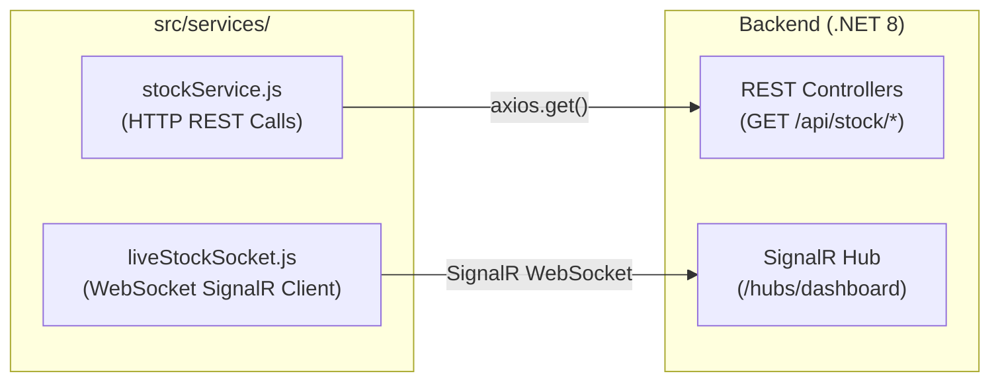
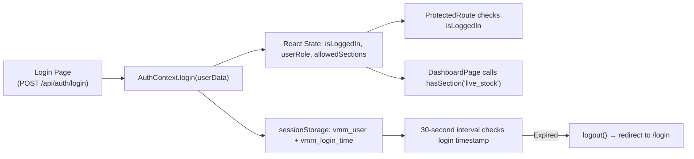

# 🗂️ Complete Project File Map — Every File Explained

This document provides a **complete tree-map** of the entire `POS_Web_Application React V2` project. Every file and folder is explained so a new developer can immediately understand where to find anything.

---

## 📁 Root Level

```
POS_Web_Application React V2/
├── .agents/                    # Agent configuration and rules (AGENTS.md, skills)
│   └── AGENTS.md               # AI development rules, UI design system, git constraints
├── .env                        # Local development environment variables
├── .env.production             # Production environment variables
├── .gitignore                  # Files excluded from Git tracking
├── index.html                  # SPA entry point (the ONLY HTML file in the entire app!)
├── package.json                # NPM dependencies and scripts
├── package-lock.json           # Locked dependency versions
├── vite.config.js              # Vite bundler configuration (port, aliases, proxy)
├── md/                         # 📚 Documentation folder (you are here!)
└── src/                        # 🔥 All application source code
```

---

## 📁 `src/` — Application Source Code

```
src/
├── main.jsx                    # React Entry Point: renders <App /> into the DOM
├── App.jsx                     # Root Component: React Router setup, all <Route> definitions
├── App.css                     # Global application styles
├── index.css                   # CSS reset and base typography
│
├── config/                     # ⚙️ Configuration & Constants
│   └── constants.js            # API defaults, User ID, Store Name Mapping dictionary
│
├── context/                    # 🔒 React Context (Global State)
│   └── AuthContext.jsx          # Auth state, login/logout, RBAC hasSection(), session timer
│
├── hooks/                      # 🪝 Custom React Hooks
│   ├── useDashboardData.js     # ALL 11 dashboard data hooks (useLiveStock, useCycleCount, etc.)
│   └── useIsInViewport.js      # Lazy rendering hook (IntersectionObserver)
│
├── services/                   # 🌐 API & WebSocket Communication Layer
│   ├── stockService.js         # Axios HTTP functions for all 11 dashboard + 6 report APIs
│   └── liveStockSocket.js      # SignalR WebSocket client (DashboardSocketService singleton)
│
├── components/                 # 🧩 Reusable UI Components
│   ├── charts/                 # Chart & Data Visualization widgets
│   ├── common/                 # Shared UI components (dropdowns, search, modals)
│   ├── layout/                 # Page layout (sidebar, header, AppLayout)
│   ├── modals/                 # Modal dialogs
│   └── tables/                 # Data table components
│
├── pages/                      # 📄 Page-Level Components (Route targets)
│   ├── Dashboard/              # Main V2 Dashboard (10 visual sections)
│   ├── DashboardOld/           # Previous dashboard iteration (kept as reference)
│   ├── Report/                 # Report pages (Live Stock Report, GRC, Cycle Count Details)
│   ├── TagManagement/          # Tag management analytics page
│   ├── Login/                  # Login page + Under Development splash
│   ├── NotFound/               # 404 Not Found page
│   └── DevelopmentInProgress/  # "Work in Progress" placeholder page
│
└── utils/                      # 🔧 Utility Functions
```

---

## 📁 `src/services/` — Communication Layer



| File | Purpose | Protocol |
| :--- | :--- | :--- |
| **`stockService.js`** | 17 exported `async` functions for dashboard + report API calls via Axios | HTTP GET |
| **`liveStockSocket.js`** | Singleton `DashboardSocketService` class managing SignalR connection for 7 real-time channels | WebSocket / SignalR |

---

## 📁 `src/hooks/` — Custom React Hooks

| File | Hooks Exported | Purpose |
| :--- | :--- | :--- |
| **`useDashboardData.js`** | `useLiveStock`, `useCycleCount`, `useStoreDashboard`, `useSaleDashboard`, `useVoidDashboard`, `useReturnDashboard`, `useVendorDiscrepancy`, `useDcValidation`, `useWarehouseEncoding`, `useTagCharts` | Central data management: fetching, caching, SignalR patching, search debounce, pagination |
| **`useIsInViewport.js`** | `useIsInViewport` | Lazy-render chart SVGs only when scrolled into the viewport (IntersectionObserver) |

---

## 📁 `src/components/charts/` — Chart & KPI Widgets

| File | Component | Used For |
| :--- | :--- | :--- |
| `KpiCard.jsx` | `KpiCard` | Dark gradient primary metric card |
| `KpiCard2.jsx` | `KpiCard2` | White secondary metric card with colored top accent, status badge, icon |
| `GroupedBarChart.jsx` | `GroupedBarChart` | Side-by-side or stacked horizontal/vertical bar comparisons |
| `SemiDonutChart.jsx` | `SemiDonutChart` | Single-value accuracy gauge (e.g., 97% accuracy) |
| `DonutChart.jsx` | `DonutChart` | Multi-segment circular breakdown |
| `TimelineChart.jsx` | `TimelineChart` | Hourly or time-block single-series bar chart |
| `ComposedChart.jsx` | `ComposedChart` | Mixed bar + line on same axes |
| `StoreRankList.jsx` | `StoreRankList` | Compact ranked list with colored badges |
| `DashboardDataGrid.jsx` | `DashboardDataGrid` | High-density data table with sortable headers & drill-down |
| `LiveStockTooltips.jsx` | Custom tooltips | Rich JSX tooltips for Live Stock charts |
| `DashboardSection.css` | — | Shared layout CSS for all chart cards (.cc-container, .cc-card, .cc-kpi-row) |
| `Charts.css` | — | Additional chart styling utilities |

---

## 📁 `src/components/common/` — Shared UI Components

| File | Component | Purpose |
| :--- | :--- | :--- |
| `SectionHeader.jsx` | `SectionHeader`, `DateBadge` | Title bar for every dashboard section (icon, title, subtitle, right content) |
| `ChartToolbar.jsx` | `ChartToolbar` | Two-slot header bar for chart cards (leftContent + rightContent) |
| `CustomDropdown.jsx` | `CustomDropdown` | Pure-CSS dropdown with outside click detection |
| `ChartSearchInput.jsx` | `ChartSearchInput` | Expandable search input with clear button |
| `ChartLegend.jsx` | `ChartLegend` | Color-dot legend strip below chart toolbars |
| `ChartPaginator.jsx` | `ChartPaginator` | Page navigation controls for paginated data |
| `ChartEmptyState.jsx` | `SearchEmptyState`, `GlobalEmptyState` | Styled empty state cards |
| `DashboardShimmer.jsx` | `DashboardShimmer` | Loading skeleton shaped like a full section |
| `LiveTickerValue.jsx` | `LiveTickerValue` | YouTube-style rolling number animation |
| `ErrorBoundary.jsx` | `ErrorBoundary` | React error boundary (catches rendering crashes gracefully) |
| `ProtectedRoute.jsx` | `ProtectedRoute` | Auth guard for routes requiring login |
| `CurvedCard.jsx` | `CurvedCard` | Dark gradient KPI metric card |
| `CustomDatePicker.jsx` | `CustomDatePicker` | Date range picker for report filters |
| `SearchableDropdown.jsx` | `SearchableDropdown` | Dropdown with text filter for store selection |
| `ReportDataTableCard.jsx` | `ReportDataTableCard` | Table card for report pages |
| `BaseDataTable.jsx` | `BaseDataTable` | Core data table for reports (NOT for dashboard) |
| `ActionAlertBar.jsx` | `ActionAlertBar` | Warning/action bar for stores below threshold |
| `WorkInProgress.jsx` | `WorkInProgress` | Under-development splash screen |

---

## 📁 `src/pages/Dashboard/sections/` — Dashboard Visual Sections

Each section file is a self-contained React component that renders one analytical view:

| File | Section | Data Hook | Live Sync |
| :--- | :--- | :--- | :--- |
| `LiveStockSection.jsx` | 📊 Live Stock (SAP vs RFID) | `useLiveStock` | ✅ SignalR 2s |
| `CycleCountSection.jsx` | 🔄 Cycle Count (Audit Durations) | `useCycleCount` | ✅ SignalR 12s |
| `StoreValidationSection.jsx` | ✅ Store Validation (GRN HU) | `useStoreDashboard` | ✅ SignalR 12s |
| `SaleDashboardSection.jsx` | 🛒 Sale Operations | `useSaleDashboard` | ❌ HTTP only |
| `VoidDashboardSection.jsx` | 🗑️ Void Dashboard | `useVoidDashboard` | ❌ HTTP only |
| `ReturnDashboardSection.jsx` | ↩️ Return Dashboard | `useReturnDashboard` | ❌ HTTP only |
| `DcValidationSection.jsx` | 🏭 DC Validation | `useDcValidation` | ✅ SignalR 12s |
| `DcEncodingSection.jsx` | 🏷️ DC Encoding | `useWarehouseEncoding` | ✅ SignalR 12s |
| `TagManagementSection.jsx` | 📍 Tag Management | `useTagCharts` | ✅ SignalR 12s |
| `VendorDiscrepancySection.jsx` | ⚠️ Vendor HU Discrepancy | `useVendorDiscrepancy` | ✅ SignalR 12s |

---

## 📁 `src/context/` — Global State

| File | Context | Provides |
| :--- | :--- | :--- |
| `AuthContext.jsx` | `AuthProvider` / `useAuth` | `isLoggedIn`, `loggedInUser`, `userId`, `userRole`, `allowedSections`, `hasSection(key)`, `login()`, `logout()`, session expiry timer |

### Auth Flow:


---

## 📁 Backend Architecture (VS_mart_Backend — Reference)

```
VS_mart_Backend/
├── Features/
│   ├── Dashboard/
│   │   ├── Hubs/
│   │   │   └── DashboardHub.cs              # SignalR Hub with 7 broadcast methods
│   │   └── DashboardSectionsPollerService.cs # 1-sec PeriodicTimer background poller
│   ├── MainDashboard/
│   │   ├── LiveStockService.cs              # Dapper/ADO.NET data access (all 11 SPs)
│   │   └── ModernReportController.cs        # Report API controllers
│   └── Auth/
│       └── AuthController.cs                # Login validation
├── Services/
│   └── CacheWarmerService.cs                # Dynamic Super Admin startup warmer
└── Program.cs                               # DI registration, SignalR map, CORS, middleware
```
