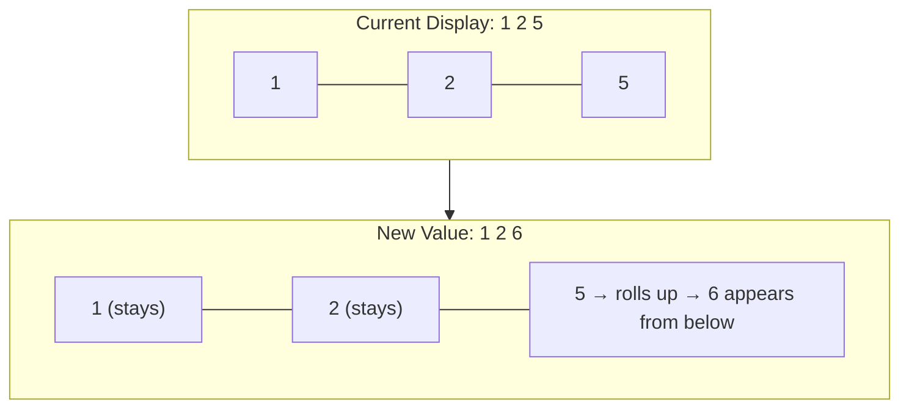

# ✨ CSS Animations, Shimmer Loaders & Micro-Interactions Guide

> This guide documents every CSS animation and visual micro-interaction used in the VMM V2 Dashboard, with real code and visual flowcharts explaining how they work.

---

## 📑 Table of Contents
1. [The Shimmer Loading Skeleton](#1-the-shimmer-loading-skeleton)
2. [The Live Number Ticker (Rolling Digits)](#2-the-live-number-ticker-rolling-digits)
3. [The Row Highlight Flash (SignalR Update Indicator)](#3-the-row-highlight-flash-signalr-update-indicator)
4. [The Live Sync Pill (Connection Status Badge)](#4-the-live-sync-pill-connection-status-badge)
5. [The KPI Card Top Accent Bar Gradient](#5-the-kpi-card-top-accent-bar-gradient)
6. [Dropdown Menu Open/Close Transition](#6-dropdown-menu-openclose-transition)
7. [Chart Entry Animation (Recharts)](#7-chart-entry-animation-recharts)

---

## 1. The Shimmer Loading Skeleton

When a dashboard section is still fetching data from the API, instead of showing a boring spinner, we display **skeleton boxes** that pulse with a flowing gradient, mimicking the shape of the content that will appear.

### How It Looks:
```
+--------------------------------------------+
|  ████ Section Header ████      [Date]      |
+--------------------------------------------+
| ░░░░░░░░ | ░░░░░░░░ | ░░░░░░░░ | ░░░░░░░ |  ← KPI row (5 pulsing boxes)
|   ▓▓▓▓▓▓▓▓▓▓▓▓▓▓▓▓▓▓▓▓▓▓▓▓▓▓▓▓▓▓▓▓▓▓▓▓▓  |  ← Chart area (tall pulsing box)
|   ▓▓▓▓▓▓▓▓▓▓▓▓▓▓▓▓▓▓▓▓▓▓▓▓▓▓▓▓▓▓▓▓▓▓▓▓▓  |  ← Data grid area (pulsing box)
+--------------------------------------------+
```

### The CSS Animation:
```css
/* The skeleton container */
.ds-skeleton-box {
  background: #e2e8f0;         /* Light gray base color */
  border-radius: 12px;
  overflow: hidden;            /* Clip the shimmer child to the box boundaries */
  position: relative;
}

/* The shimmer is a child element with a moving gradient */
.ds-shimmer {
  position: absolute;
  top: 0; left: 0; right: 0; bottom: 0;  /* Fill the entire parent box */

  /* A gradient that goes: transparent → white → transparent */
  background: linear-gradient(
    90deg,
    transparent 0%,              /* Left edge: invisible */
    rgba(255, 255, 255, 0.5) 50%,/* Middle: bright white streak */
    transparent 100%             /* Right edge: invisible */
  );

  /* Stretch it wider than the box so the white streak can slide across */
  background-size: 200% 100%;

  /* The animation! Slides the gradient from right to left infinitely */
  animation: shimmerSlide 1.5s infinite ease-in-out;
}

/* Keyframes: Move the gradient position from 100% to -100% */
@keyframes shimmerSlide {
  0%   { background-position: 100% 0; }   /* Start: white streak is off-screen right */
  100% { background-position: -100% 0; }  /* End: white streak has slid past left edge */
}
```

### The React Component:
```jsx
// src/components/common/DashboardShimmer.jsx
export default function DashboardShimmer({ title }) {
  return (
    <div className="cc-container">
      <SectionHeader title={title} rightContent={<DateBadge />} />
      
      {/* 5 skeleton KPI cards */}
      <div className="cc-kpi-row">
        {[1, 2, 3, 4, 5].map(i => (
          <div key={i} className="ds-skeleton-box" style={{ height: '80px', borderRadius: '12px' }}>
            <div className="ds-shimmer" />
          </div>
        ))}
      </div>
      
      {/* Skeleton chart area */}
      <div className="ds-skeleton-box" style={{ height: '352px', borderRadius: '20px' }}>
        <div className="ds-shimmer" />
      </div>
      
      {/* Skeleton data grid */}
      <div className="ds-skeleton-box" style={{ minHeight: '200px', borderRadius: '20px' }}>
        <div className="ds-shimmer" />
      </div>
    </div>
  );
}
```

---

## 2. The Live Number Ticker (Rolling Digits)

The KPI cards use a YouTube-style rolling digit animation. When a value changes from `125` to `126`, only the last digit rolls upward while the `1` and `2` stay static.

### How It Works:


### Key Implementation Concepts:
```jsx
// src/components/common/LiveTickerValue.jsx

// 1. Break the number "1,26" into individual characters
const characters = formattedString.split(''); // ['1', ',', '2', '6']

// 2. Each character is wrapped in a container with overflow: hidden
// 3. The digit slides vertically using framer-motion's AnimatePresence

// For DIGITS: Slide vertically (up when increasing, down when decreasing)
<AnimatePresence mode="popLayout">
  <motion.span
    key={`${item.key}-${char}`}
    initial={shouldAnimate ? { y: direction === 'up' ? '100%' : '-100%', opacity: 0 } : false}
    animate={{ y: 0, opacity: 1 }}
    exit={{ y: direction === 'up' ? '-100%' : '100%', opacity: 0 }}
    transition={{ type: 'spring', stiffness: 80, damping: 15, duration }}
  >
    {char}
  </motion.span>
</AnimatePresence>
```

### Visual Example:
```
Value changes: 81,881 → 79,214

Digit positions:  [8] [1] [,] [8] [8] [1]
                   ↓   ↓       ↓   ↓   ↓
Direction: DOWN   [7] [9] [,] [2] [1] [4]   ← digits slide DOWN (value decreased)
```

---

## 3. The Row Highlight Flash (SignalR Update Indicator)

When a WebSocket patch arrives and updates a store's data, that specific row in the chart and data grid **glows green for 2.5 seconds**, then fades back to normal.

### The Mechanism:
```javascript
// In useLiveStock hook (useDashboardData.js)
const [highlightedStore, setHighlightedStore] = useState(null);

// When a SignalR patch arrives:
const unsubPatch = liveStockSocket.onPatch((patch) => {
  // Update the data row...
  
  // Flash the store name green for 2.5 seconds
  setHighlightedStore(patch.storeCode);
  
  // Clear after timeout
  if (highlightTimer) clearTimeout(highlightTimer);
  highlightTimer = setTimeout(() => {
    setHighlightedStore(null);
  }, 2500);
});
```

### The CSS:
```css
/* Normal state */
.cc-data-grid-tr {
  transition: background-color 0.5s ease;
}

/* Highlighted state (triggered by className toggle) */
.cc-data-grid-tr.highlighted {
  background-color: rgba(16, 185, 129, 0.12); /* Emerald green with 12% opacity */
  animation: rowPulse 2.5s ease-out;
}

@keyframes rowPulse {
  0%   { background-color: rgba(16, 185, 129, 0.25); } /* Bright green */
  50%  { background-color: rgba(16, 185, 129, 0.12); } /* Fading */
  100% { background-color: transparent; }                /* Back to normal */
}
```

---

## 4. The Live Sync Pill (Connection Status Badge)

Each dashboard section that supports real-time updates shows a small colored pill indicating the WebSocket connection status.

### Three States:
```
🟢 Live Sync (2s)     ← Connected and receiving updates every 2 seconds
🟡 Connecting...      ← WebSocket is negotiating or reconnecting
🔴 Offline            ← Connection lost, operating on cached data
```

### The CSS:
```css
.live-sync-pill {
  display: flex;
  align-items: center;
  gap: 6px;
  padding: 4px 12px;
  border-radius: 20px;
  font-size: 11px;
  font-weight: 600;
  letter-spacing: 0.02em;
  transition: all 0.3s ease;
}

/* Connected: Green */
.live-sync-pill.connected {
  background: rgba(16, 185, 129, 0.1);
  color: #059669;
  border: 1px solid rgba(16, 185, 129, 0.3);
}

/* Connecting: Yellow */
.live-sync-pill.connecting {
  background: rgba(245, 158, 11, 0.1);
  color: #d97706;
  border: 1px solid rgba(245, 158, 11, 0.3);
}

/* Disconnected: Red */
.live-sync-pill.disconnected {
  background: rgba(239, 68, 68, 0.1);
  color: #dc2626;
  border: 1px solid rgba(239, 68, 68, 0.3);
}

/* The pulsing dot */
.live-sync-dot {
  width: 6px;
  height: 6px;
  border-radius: 50%;
  background: currentColor;
  animation: syncPulse 2s infinite;
}

@keyframes syncPulse {
  0%, 100% { opacity: 1; transform: scale(1); }
  50%      { opacity: 0.4; transform: scale(0.8); }
}
```

---

## 5. The KPI Card Top Accent Bar Gradient

Each KPI card has a thin colored bar across its top edge. Different metrics have different colors to provide at-a-glance categorization.

```
 ═══════════════ (green gradient bar)
| HU Validated   |
| 125            |
| ✓ Processed    |
 ═══════════════
```

### The Variants:
```css
/* Lime/Green (default) */
.kpi2-accent-default {
  background: linear-gradient(90deg, #84cc16, #a3e635, #84cc16);
}

/* Green (success) */
.kpi2-accent-success {
  background: linear-gradient(90deg, #22c55e, #86efac, #22c55e);
}

/* Pink/Magenta */
.kpi2-accent-pink {
  background: linear-gradient(90deg, #ec4899, #f9a8d4, #ec4899);
}

/* Cyan/Teal */
.kpi2-accent-cyan {
  background: linear-gradient(90deg, #06b6d4, #67e8f9, #06b6d4);
}

/* Warning (amber/yellow) */
.kpi2-accent-warning {
  background: linear-gradient(90deg, #f59e0b, #fbbf24, #f59e0b);
}

/* Danger (red) */
.kpi2-accent-danger {
  background: linear-gradient(90deg, #ef4444, #fca5a5, #ef4444);
}

/* Purple */
.kpi2-accent-purple {
  background: linear-gradient(90deg, #8b5cf6, #c4b5fd, #8b5cf6);
}
```

---

## 6. Dropdown Menu Open/Close Transition

The custom dropdown menu slides down smoothly when opened:

```css
.ls-dropdown-menu {
  position: absolute;
  top: calc(100% + 4px);     /* 4px gap below the trigger button */
  background: white;
  border-radius: 12px;
  box-shadow: 0 8px 30px rgba(0, 0, 0, 0.12);
  border: 1px solid #e2e8f0;
  z-index: 1000;
  
  /* Entry animation */
  animation: dropdownSlideIn 0.15s ease-out;
}

@keyframes dropdownSlideIn {
  from {
    opacity: 0;
    transform: translateY(-8px); /* Start slightly above */
  }
  to {
    opacity: 1;
    transform: translateY(0);   /* Settle into position */
  }
}

/* Individual menu items have a hover transition */
.ls-dropdown-item {
  padding: 8px 14px;
  cursor: pointer;
  transition: background-color 0.15s ease;
}

.ls-dropdown-item:hover {
  background-color: #f1f5f9;  /* Subtle gray highlight */
}

.ls-dropdown-item.active {
  background-color: #eff6ff;  /* Light blue for selected item */
  color: #1d4ed8;
  font-weight: 600;
}
```

---

## 7. Chart Entry Animation (Recharts)

Recharts bar charts support built-in entry animations. We use `ease-out` easing with a 500ms duration so bars grow outward from the axis:

```jsx
<Bar 
  dataKey="HU_RECEIVED_QTY" 
  name="Received HU" 
  barSize={16} 
  fill="#3b82f6" 
  radius={[4, 4, 4, 4]}           // Rounded corners on all 4 sides
  isAnimationActive={true}         // Enable entry animation
  animationDuration={500}          // 500ms grow animation
  animationEasing="ease-out"       // Fast start, slow finish (natural feel)
  cursor="pointer"                 // Show pointer on hover
/>
```

### Animation Easing Comparison:
```
ease-out:    ████████████████▓▓▓▓▒▒░░  (fast start, gradual stop → feels "snappy")
ease-in:     ░░▒▒▓▓▓▓████████████████  (slow start, fast end → feels "heavy")
linear:      ████████████████████████  (constant speed → feels "robotic")
ease-in-out: ░░▒▒▓▓██████████▓▓▒▒░░  (slow start, slow end → feels "smooth")
```

We chose **`ease-out`** because it makes bars appear to "shoot out" from the axis and settle naturally — giving the dashboard an energetic, responsive feel.
