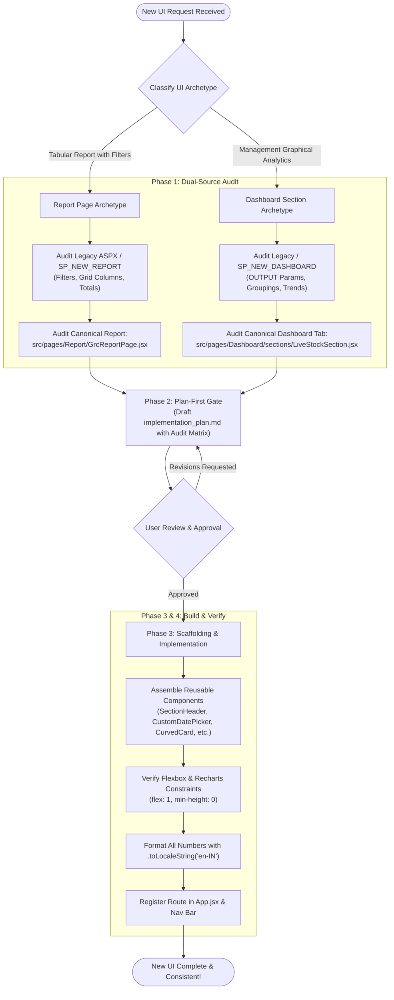

# 🎨 UI Creation & Design Consistency Playbook — Old UI to New UI Protocol

> **Target Audience:** Frontend Engineers, Full-Stack Developers, and AI Agents building new user interfaces in `POS_Web_Application React V2`.  
> **Core Objective:** Guarantee 100% visual consistency and data fidelity across the application by systematically auditing existing ("old") UIs before writing any new UI code.

---

## 📑 Table of Contents
1. [The "Old UI → New UI" Philosophy](#1-the-old-ui--new-ui-philosophy)
2. [End-to-End Workflow Diagram](#2-end-to-end-workflow-diagram)
3. [The Two UI Archetypes in VMM V2](#3-the-two-ui-archetypes-in-vmm-v2)
4. [Archetype 1: Report Pages (Tabular & Filter-Driven)](#4-archetype-1-report-pages-tabular--filter-driven)
5. [Archetype 2: Dashboard Analytics Tabs (Graphical 3-Row Pattern)](#5-archetype-2-dashboard-analytics-tabs-graphical-3-row-pattern)
6. [Legacy Data Contract Audit Guide](#6-legacy-data-contract-audit-guide)
7. [Design Tokens & Reusable Component Catalog](#7-design-tokens--reusable-component-catalog)
8. [The `/new-ui` Slash Command Quick Reference](#8-the-new-ui-slash-command-quick-reference)

---

## 1. The "Old UI → New UI" Philosophy

In enterprise retail management systems like Vishal Mega Mart (VMM), consistency is not just an aesthetic preference — it directly determines cashier, auditor, and store manager efficiency. 

When creating a new screen, **never design or code from a blank canvas**. Every new screen is either:
1. A modernization of a **legacy ASPX / Tabular screen**, or
2. A new view that must look, feel, and behave identically to our **existing V2 canonical screens**.

### The Dual-Source Audit Rule
Before creating any JSX or CSS, you must audit two distinct sources:
```
┌──────────────────────────────────────┐       ┌──────────────────────────────────────┐
│       SOURCE 1: LEGACY AUDIT         │       │        SOURCE 2: V2 AUDIT            │
│  (Data Fidelity & Business Logic)    │       │     (Visual Consistency & Layout)    │
├──────────────────────────────────────┤       ├──────────────────────────────────────┤
│ • What input filters are required?   │       │ • Which canonical V2 page matches?  │
│   (Date range, Store, Vendor, Dept)  │       │ • What reusable components to use?   │
│ • What columns does the grid have?   │  AND  │ • What layout archetype to follow?   │
│ • What summary totals are returned?  │       │ • Which CSS classes from our design  │
│   (OUTPUT parameters, sums, diffs)   │       │   system should be applied?          │
└──────────────────────────────────────┘       └──────────────────────────────────────┘
```

---

## 2. End-to-End Workflow Diagram



---

## 3. The Two UI Archetypes in VMM V2

| Attribute | Archetype 1: Report Pages | Archetype 2: Dashboard Sections |
| :--- | :--- | :--- |
| **Location** | `src/pages/Report/` | `src/pages/Dashboard/sections/` |
| **Primary Purpose** | Operational auditing, item-level drilldowns, CSV/Excel export | Executive overview, visual trends, side-by-side comparisons |
| **Header** | Page Title + Subtitle + Action Toolbar | Reusable `<SectionHeader />` |
| **Filters** | `CustomDatePicker` + `SearchableDropdown` / `CustomDropdown` | Section-level store selector or global date filter |
| **Summary Row** | Metric badge cards (total records, total qty, discrepancy) | `CurvedCard` (dark gradient) + `KpiCard` (white cards) |
| **Data Visualization** | `ReportDataTableCard` or `BaseDataTable` | Recharts wrappers: `GroupedBarChart`, `SemiDonutChart`, `DonutChart` |
| **Rankings / Lists** | Pagination inside data table | Compact `<StoreRankList />` |
| **Data Tables Allowed?** | **YES (Required)** | **STRICTLY FORBIDDEN** (Tables belong in Report pages only) |
| **Canonical Reference** | [`src/pages/Report/GrcReportPage.jsx`](../src/pages/Report/GrcReportPage.jsx) | [`src/pages/Dashboard/sections/LiveStockSection.jsx`](../src/pages/Dashboard/sections/LiveStockSection.jsx) |

---

## 4. Archetype 1: Report Pages (Tabular & Filter-Driven)

### Visual Anatomy
```
┌──────────────────────────────────────────────────────────────────────────────┐
│  PAGE TITLE (e.g. Goods Receipt Confirmation Report)                         │
│  [ From Date  📅 ] [ To Date  📅 ] [ Select Store  ▼ ]  [ 🔍 Search ] [ ⟳ Clear ] │
├──────────────────────────────────────────────────────────────────────────────┤
│  [ Total Invoices: 1,240 ]  [ Received Qty: 45,210 ]  [ Shortage: 124 ]      │
├──────────────────────────────────────────────────────────────────────────────┤
│  ┌────────────────────────────────────────────────────────────────────────┐  │
│  │ 🔍 Search table...                      [ 📥 Export Excel ] [ 🖨️ Print ] │  │
│  ├─────────────┬─────────────┬─────────────┬──────────────┬───────────────┤  │
│  │ Invoice No  │ Store Code  │ Article     │ Scanned Qty  │ System Qty    │  │
│  ├─────────────┼─────────────┼─────────────┼──────────────┼───────────────┤  │
│  │ INV-9901    │ 1001        │ 40012938    │ 50           │ 50            │  │
│  │ INV-9902    │ 1004        │ 40018821    │ 12           │ 15            │  │
│  └─────────────┴─────────────┴─────────────┴──────────────┴───────────────┘  │
│  Showing 1 to 10 of 250 records                            < [1] 2 3 >       │
└──────────────────────────────────────────────────────────────────────────────┘
```

### Canonical Production Template (`ReportPageTemplate.jsx`)
```jsx
import React, { useState, useEffect, useMemo, useCallback } from 'react';
import CustomDatePicker from '../../components/common/CustomDatePicker';
import SearchableDropdown from '../../components/common/SearchableDropdown';
import ReportDataTableCard from '../../components/common/ReportDataTableCard';
import DashboardShimmer from '../../components/common/DashboardShimmer';
import ErrorBoundary from '../../components/common/ErrorBoundary';
import stockService from '../../services/stockService';
import './ReportPageTemplate.css';

const ReportPageTemplate = () => {
  // 1. Filter State (Defaults: Last 7 Days, All Stores)
  const [startDate, setStartDate] = useState(() => {
    const d = new Date();
    d.setDate(d.getDate() - 7);
    return d.toISOString().split('T')[0];
  });
  const [endDate, setEndDate] = useState(() => new Date().toISOString().split('T')[0]);
  const [selectedStore, setSelectedStore] = useState('ALL');
  const [storeOptions, setStoreOptions] = useState([]);

  // 2. Data & Status State
  const [data, setData] = useState([]);
  const [summary, setSummary] = useState({ totalRecords: 0, totalQty: 0, shortQty: 0 });
  const [isLoading, setIsLoading] = useState(false);
  const [error, setError] = useState(null);

  // 3. Load Filter Options (Stores) on Mount
  useEffect(() => {
    const loadStores = async () => {
      try {
        const stores = await stockService.getStoreList();
        setStoreOptions([{ value: 'ALL', label: 'All Stores' }, ...stores]);
      } catch (err) {
        console.error('Failed to load stores:', err);
      }
    };
    loadStores();
  }, []);

  // 4. Fetch Report Data
  const fetchData = useCallback(async () => {
    setIsLoading(true);
    setError(null);
    try {
      const response = await stockService.getReportData({
        fromDate: startDate,
        toDate: endDate,
        storeCode: selectedStore
      });

      setData(response.data || []);
      setSummary(response.summary || {
        totalRecords: response.data?.length || 0,
        totalQty: response.data?.reduce((sum, r) => sum + (Number(r.QTY) || 0), 0),
        shortQty: response.data?.reduce((sum, r) => sum + (Number(r.SHORT_QTY) || 0), 0)
      });
    } catch (err) {
      setError(err.message || 'Failed to load report data');
    } finally {
      setIsLoading(false);
    }
  }, [startDate, endDate, selectedStore]);

  useEffect(() => {
    fetchData();
  }, [fetchData]);

  // 5. Column Definitions for ReportDataTableCard
  const columns = useMemo(() => [
    { key: 'STORE_CODE', title: 'Store Code', sortable: true },
    { key: 'STORE_NAME', title: 'Store Name', sortable: true },
    { key: 'ARTICLE_CODE', title: 'Article', sortable: true },
    { 
      key: 'SCANNED_QTY', 
      title: 'Scanned Qty', 
      sortable: true,
      render: (val) => Number(val || 0).toLocaleString('en-IN') 
    },
    { 
      key: 'SYSTEM_QTY', 
      title: 'System Qty', 
      sortable: true,
      render: (val) => Number(val || 0).toLocaleString('en-IN') 
    },
    { 
      key: 'SHORT_QTY', 
      title: 'Shortage', 
      sortable: true,
      render: (val) => {
        const num = Number(val || 0);
        return (
          <span style={{ color: num > 0 ? '#ef4444' : '#10b981', fontWeight: 600 }}>
            {num.toLocaleString('en-IN')}
          </span>
        );
      }
    }
  ], []);

  return (
    <ErrorBoundary>
      <div className="report-page-container">
        {/* Row 1: Header & Filter Bar */}
        <div className="report-header-card">
          <div className="report-title-group">
            <h1 className="report-title">Goods Receipt Confirmation Report</h1>
            <p className="report-subtitle">Store-wise physical vs system stock reconciliation</p>
          </div>

          <div className="report-filter-toolbar">
            <div className="filter-group">
              <label>From Date</label>
              <CustomDatePicker value={startDate} onChange={setStartDate} />
            </div>
            <div className="filter-group">
              <label>To Date</label>
              <CustomDatePicker value={endDate} onChange={setEndDate} />
            </div>
            <div className="filter-group">
              <label>Store</label>
              <SearchableDropdown
                options={storeOptions}
                value={selectedStore}
                onChange={setSelectedStore}
                placeholder="Search store..."
              />
            </div>
            <button className="btn-primary" onClick={fetchData} disabled={isLoading}>
              {isLoading ? 'Searching...' : 'Search'}
            </button>
          </div>
        </div>

        {/* Row 2: KPI Badges */}
        <div className="report-kpi-row">
          <div className="report-kpi-badge">
            <span className="badge-label">Total Records</span>
            <span className="badge-value">{summary.totalRecords.toLocaleString('en-IN')}</span>
          </div>
          <div className="report-kpi-badge">
            <span className="badge-label">Total Quantity</span>
            <span className="badge-value">{summary.totalQty.toLocaleString('en-IN')}</span>
          </div>
          <div className="report-kpi-badge badge-warning">
            <span className="badge-label">Total Shortage</span>
            <span className="badge-value">{summary.shortQty.toLocaleString('en-IN')}</span>
          </div>
        </div>

        {/* Row 3: Data Table Card */}
        {isLoading ? (
          <DashboardShimmer type="table" />
        ) : (
          <ReportDataTableCard
            title="Detailed Audit Records"
            data={data}
            columns={columns}
            searchable={true}
            exportable={true}
            error={error}
          />
        )}
      </div>
    </ErrorBoundary>
  );
};

export default ReportPageTemplate;
```

---

## 5. Archetype 2: Dashboard Analytics Tabs (Graphical 3-Row Pattern)

Dashboard sections reside in `src/pages/Dashboard/sections/` and render inside the tab controller in `DashboardPage.jsx`.

### Visual Anatomy (The 3-Row Pattern)
```
┌──────────────────────────────────────────────────────────────────────────────┐
│  <SectionHeader title="Live Stock Dashboard" onRefresh={...} />              │
├──────────────────────────────────────────────────────────────────────────────┤
│  ROW 1: KPI ROW (.ds-kpi-row)                                                │
│  ┌───────────────────────┐ ┌──────────────┐ ┌──────────────┐ ┌─────────────┐ │
│  │ <CurvedCard />        │ │ <KpiCard />  │ │ <KpiCard />  │ │ <KpiCard /> │ │
│  │ Total System Stock    │ │ Scanned RFID │ │ Accuracy %   │ │ Discrepant  │ │
│  │ 1,482,900             │ │ 1,460,110    │ │ 98.46%       │ │ 22,790      │ │
│  └───────────────────────┘ └──────────────┘ └──────────────┘ └─────────────┘ │
├──────────────────────────────────────────────────────────────────────────────┤
│  ROW 2: CHARTS ROW (.ds-charts-row)                                          │
│  ┌────────────────────────────────────────┐ ┌──────────────────────────────┐ │
│  │ <GroupedBarChart />                    │ │ <SemiDonutChart />           │ │
│  │ SAP Stock vs Physically Scanned RFID   │ │ Overall Scanning Accuracy    │ │
│  │ (Top 10 Stores)                        │ │ [======== 98.5% ========>]   │ │
│  └────────────────────────────────────────┘ └──────────────────────────────┘ │
├──────────────────────────────────────────────────────────────────────────────┤
│  ROW 3: LIST ROW                                                             │
│  ┌─────────────────────────────────────────────────────────────────────────┐ │
│  │ <StoreRankList title="Stores with Highest Discrepancy" />               │ │
│  │ #1 Delhi Central — 4,210 units short (3.2%)                             │ │
│  │ #2 Mumbai Mega   — 3,110 units short (2.8%)                             │ │
│  └─────────────────────────────────────────────────────────────────────────┘ │
└──────────────────────────────────────────────────────────────────────────────┘
```

### Strict Rules for Dashboard Sections
1. **Always Use the V2 Chart Library**: Use `SectionHeader`, `CurvedCard`, `KpiCard`, `GroupedBarChart`, `SemiDonutChart`, `DonutChart`, `TimelineChart`, and `StoreRankList`.
2. **Never Put Data Tables in Dashboards**: If detailed item-level auditing is required, link the user to the corresponding **Report Page**.
3. **Strict Flexbox Constraint Rule**:
   ```css
   /* Required wrapper style for any chart parent to prevent Recharts 0px collapse */
   .ds-chart-card {
     display: flex;
     flex-direction: column;
     min-width: 0;
   }
   .ds-chart-body {
     flex: 1;
     min-height: 0;
     position: relative;
   }
   ```
4. **Data Hook Usage**: Always consume pre-existing hooks in `src/hooks/useDashboardData.js`. If a new endpoint is added, register the hook in `useDashboardData.js` rather than writing ad-hoc `useEffect` fetch loops in section components.

---

## 6. Legacy Data Contract Audit Guide

When inspecting a legacy screen or SQL stored procedure before coding:

### 1. Identify SQL Parameters
Look at the stored procedure definition (e.g. `SP_NEW_DASHBOARD` or `SP_NEW_REPORT`):
- What is the `@status` string? (e.g. `'CYCLE_COUNT_REPORT_VIEW'`, `'SALE_DASHBOARD'`).
- What date format is expected? (Typically `'YYYY-MM-DD'` or `'DD-MMM-YYYY'`).
- Does it accept `@STORE_CODE` or `@STORE_ID`?

### 2. Map Output Parameters for Summary Cards
Summary totals in VMM legacy stored procedures are returned as **OUTPUT parameters**, NOT in a second result set:
```csharp
// C# Service Mapping Pattern:
cmd.Parameters.Add("@QTY", SqlDbType.BigInt).Direction = ParameterDirection.Output;
cmd.Parameters.Add("@HU_VALIDATED_QTY", SqlDbType.BigInt).Direction = ParameterDirection.Output;
cmd.Parameters.Add("@HU_WRONG_QTY", SqlDbType.BigInt).Direction = ParameterDirection.Output;

// Read AFTER closing the reader:
reader.Close();
summary.TotalQty = Convert.ToInt64(cmd.Parameters["@QTY"].Value ?? 0);
```

### 3. Handle Mixed-Case Column Names
Legacy queries frequently mix casing (e.g. `Store_Name`, `STORE_NAME`, `store_name`). 
In React, always normalize keys in your service layer or use safe accessors:
```javascript
const storeName = row.STORE_NAME || row.Store_Name || row.store_name || 'N/A';
const scannedQty = Number(row.SCANNED_QTY || row.Scanned_Qty || 0);
```

### 4. Always Provide Fallback Summary Metadata
Even if the database returns 0 rows for a selected store/date, your service must populate:
```json
{
  "data": [],
  "summary": {
    "storeName": "Store 1004 - Gurugram",
    "date": "2026-09-13",
    "totalRecords": 0
  }
}
```
This guarantees the frontend info bar renders the selected store name rather than collapsing.

---

## 7. Design Tokens & Reusable Component Catalog

### CSS Variables & Palette Tokens
Always use these exact color variables defined in `src/styles/variables.css`:
```css
:root {
  --color-primary: #1d4ed8;       /* Royal Blue */
  --color-primary-hover: #1e3a8a; /* Deep Navy */
  --color-primary-light: #eff6ff; /* Pale Ice Blue */
  --color-text-main: #0f172a;     /* Slate 900 */
  --color-text-muted: #64748b;    /* Slate 500 */
  --color-border: #f1f5f9;        /* Border Gray */
  --color-card-bg: #ffffff;       /* Pure White */
  --color-success: #10b981;       /* Emerald */
  --color-warning: #f59e0b;       /* Amber */
  --color-danger: #ef4444;        /* Crimson Red */
}
```

### Component Catalog Matrix
| Component | Source File | Purpose | When to Use |
| :--- | :--- | :--- | :--- |
| `SectionHeader` | `components/common/SectionHeader.jsx` | Header with title, subtitle, refresh button, live status pill | Top of every Dashboard tab |
| `CustomDatePicker` | `components/common/CustomDatePicker.jsx` | Pure-CSS accessible calendar picker | Any date filter |
| `SearchableDropdown` | `components/common/SearchableDropdown.jsx` | Virtualized searchable select menu | Store/vendor/department picker |
| `ReportDataTableCard` | `components/common/ReportDataTableCard.jsx` | Full data table with search, sorting, pagination, and export | Report Pages only |
| `CurvedCard` | `components/common/CurvedCard.jsx` | Primary dark-gradient KPI card with live ticker | Top-left primary metric |
| `KpiCard` | `components/charts/KpiCard.jsx` | Clean white KPI card with icon and trend badge | Top row secondary metrics |
| `GroupedBarChart` | `components/charts/GroupedBarChart.jsx` | Side-by-side comparative bars (SAP vs RFID) | Row 2 visual analytics |
| `SemiDonutChart` | `components/charts/SemiDonutChart.jsx` | Half-circle accuracy gauge (0-100%) | Accuracy / progress metrics |
| `DonutChart` | `components/charts/DonutChart.jsx` | Multi-slice categorical breakdown | Discrepancy by category |
| `TimelineChart` | `components/charts/TimelineChart.jsx` | Hourly/time-block bar chart | Hourly scan distribution |
| `StoreRankList` | `components/charts/StoreRankList.jsx` | Compact ranked list with colored status badges | Row 3 ranked stores/vendors |
| `DashboardShimmer` | `components/common/DashboardShimmer.jsx` | Content-shaped shimmer placeholder | All loading states |

---

## 8. The `/new-ui` Slash Command Quick Reference

Whenever you want to build a new screen, type:
```
/new-ui [ScreenName]
```

### What Happens Behind the Scenes:
1. **Prompt & Archetype Detection**: Classifies the screen as a **Report Page** or **Dashboard Tab**.
2. **Dual-Source Audit**:
   - Inspects the legacy screen or SQL stored procedure for required inputs, columns, and totals.
   - Inspects the canonical V2 reference (`GrcReportPage.jsx` or `LiveStockSection.jsx`).
3. **Plan-First Scaffolding Gate**: Creates an `implementation_plan.md` containing an **Audit Comparison Table**:
   ```
   | Legacy Field / Element | V2 Component / Hook | Status |
   |---|---|---|
   | Date Range Filter | CustomDatePicker | Reusable |
   | Store Dropdown | SearchableDropdown | Reusable |
   | Total Scanned Qty | KpiCard (Top Row) | Reusable |
   | Audit Grid | ReportDataTableCard | Reusable |
   ```
4. **Approval & Scaffolding**: Waits for user review. Once approved, it generates clean JSX, scoped CSS, wires the API service, and registers the route in `App.jsx`.
