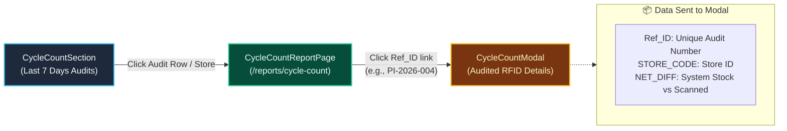
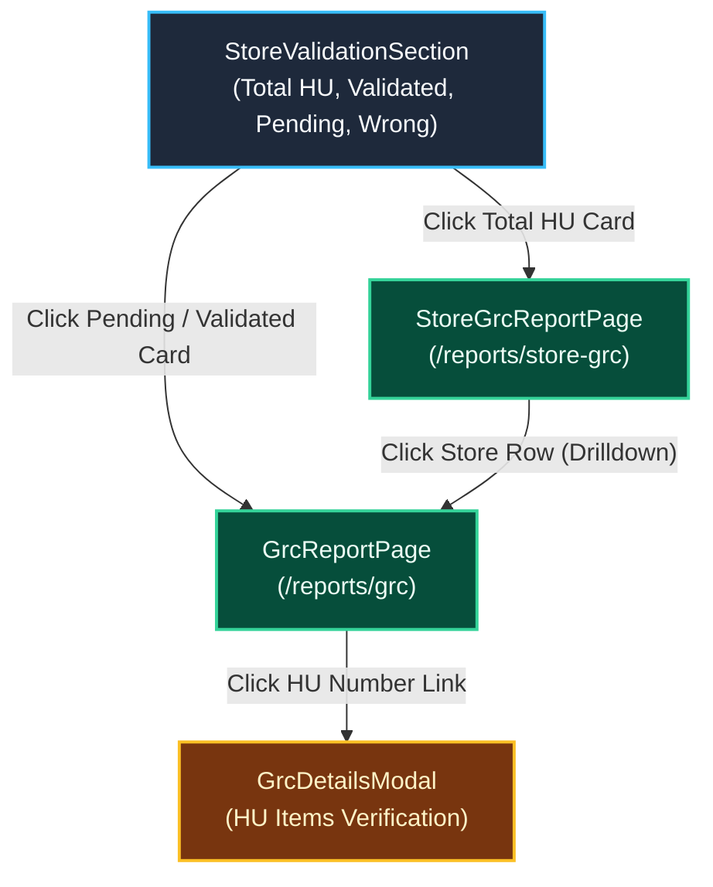
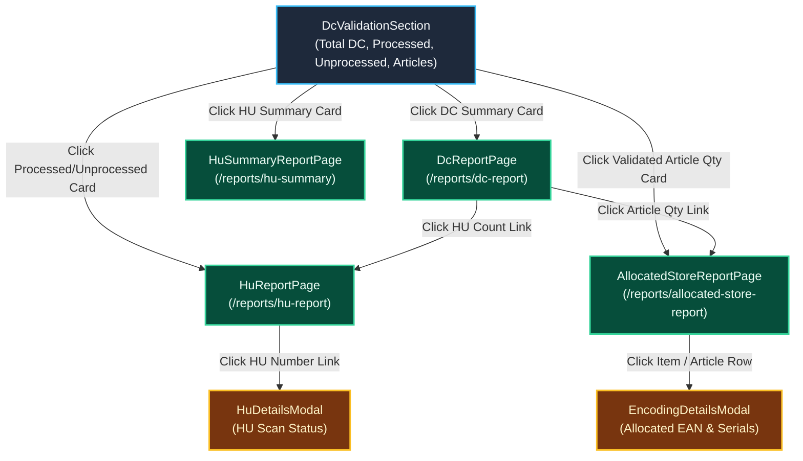
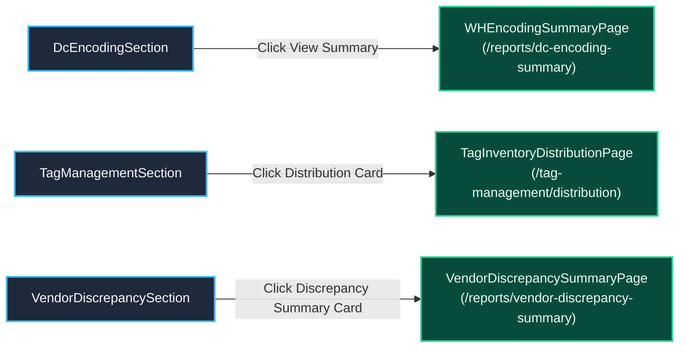
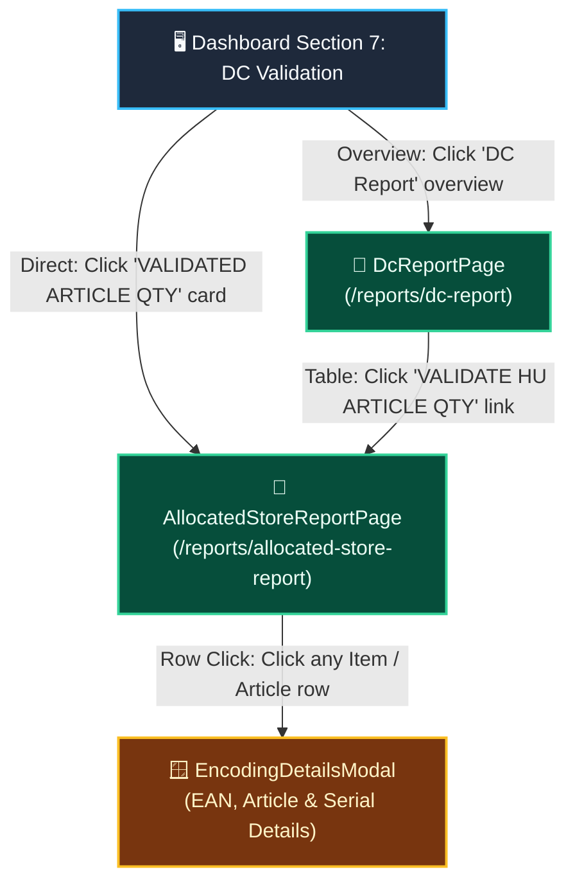

# 🗺️ VMM POS System: Visual Architecture, Flowcharts & Graph Guide

> **Purpose**: This guide maps every **Dashboard KPI Section**, **Report Page (Route)**, and **Drilldown Modal Dialog** across the VMM POS application. It is designed with **Universal Visual Diagrams**, **ASCII Box Architecture**, and **Metric Graph Breakdowns** so that any AI engine, markdown viewer, or developer can immediately visualize and understand the application's flow.

---

## 📑 Table of Contents
1. [🏛️ Universal System Architecture Flow (Universal Box Diagram)](#1-universal-system-architecture-flow)
2. [📊 Visual Metric & Data Graphs (KPI Data Distribution)](#2-visual-metric--data-graphs)
3. [🌐 Master High-Level Visual Flowchart (Mermaid)](#3-master-high-level-visual-flowchart)
4. [🔬 Domain Deep-Dive Flowcharts & Modal Triggers](#4-domain-deep-dive-flowcharts--modal-triggers)
   - [Domain A: Store Inventory & Cycle Count Audits](#domain-a-store-inventory--cycle-count-audits)
   - [Domain B: Store Receiving (GRC) & HU Validation](#domain-b-store-receiving-grc--hu-validation)
   - [Domain C: Point of Sale (DPOS), Void & Return Reconciliation](#domain-c-point-of-sale-dpos-void--return-reconciliation)
   - [Domain D: Distribution Center (DC), HU Scans & Store Allocation](#domain-d-distribution-center-dc-hu-scans--store-allocation)
   - [Domain E: Warehouse Encoding, Tags & Vendor Discrepancy](#domain-e-warehouse-encoding-tags--vendor-discrepancy)
5. [🎯 Highlight: AllocatedStoreReportPage Route Trace](#5-highlight-allocatedstorereportpage-route-trace)
6. [📋 Complete Action-to-Modal Navigation Matrix](#6-complete-action-to-modal-navigation-matrix)

---

## 1. 🏛️ Universal System Architecture Flow

*(Universal ASCII Box Flow Diagram — Renders cleanly in ANY terminal, plain text viewer, or AI chat without needing JavaScript)*

```
========================================================================================================================
LEVEL 1: DASHBOARD KPI CARDS          LEVEL 2: REPORT PAGES (ROUTES)                 LEVEL 3: DRILLDOWN MODAL DIALOGS
========================================================================================================================

┌────────────────────────────┐
│ 1. Live Stock Section      │───[ Click 'View Details' ]──────► ┌───────────────────────────────┐
│ (Current Store Inventory)  │                                   │ /reports/live-stock           │
└────────────────────────────┘                                   │ (LiveStockReportPage)         │
                                                                 └───────────────────────────────┘

┌────────────────────────────┐                                   ┌───────────────────────────────┐        ┌───────────────────────────────┐
│ 2. Cycle Count Section     │───[ Click Store / Date Row ]────► │ /reports/cycle-count          │───────►│ CycleCountModal               │
│ (System vs Scanned RFID)   │                                   │ (CycleCountReportPage)        │[RefID] │ (Audited RFID & Article Diff) │
└────────────────────────────┘                                   └───────────────────────────────┘        └───────────────────────────────┘

┌────────────────────────────┐───[ Click 'Total HU' Card ]─────► ┌───────────────────────────────┐
│ 3. Store Validation (GRC)  │                                   │ /reports/store-grc            │
│ (HU Inwarding & Reception) │───[ Click 'Pending/Valid' Card ]─┐│ (StoreGrcReportPage)          │
└────────────────────────────┘                                  │└──────────────┬────────────────┘
                                                                │               │ [Click Store Row]
                                                                ▼               ▼
                                                                 ┌───────────────────────────────┐        ┌───────────────────────────────┐
                                                                 │ /reports/grc                  │───────►│ GrcDetailsModal               │
                                                                 │ (GrcReportPage)               │ [HU#]  │ (HU Scan Status & Item List)  │
                                                                 └───────────────────────────────┘        └───────────────────────────────┘

┌────────────────────────────┐───[ Click 'Store Sale' Card ]───► ┌───────────────────────────────┐
│ 4. Sale Dashboard Section  │                                   │ /reports/store-sale           │
│ (Store / RFID / Manual)    │───[ Click 'RFID/Manual' Card ]──► │ /reports/sale (TotalDposSale) │
└────────────────────────────┘                                   └───────────────────────────────┘

┌────────────────────────────┐───[ Click 'Void Qty' Card ]─────► ┌───────────────────────────────┐
│ 5. Void Dashboard Section  │                                   │ /reports/void-details         │
│ (Cashier Void Transactions)│───[ Click 'Recon Link' ]────────┐ │ (VoidDetailsReportPage)       │
└────────────────────────────┘                                 │ └──────────────┬────────────────┘
                                                               │                │ [Click Diff Qty]
                                                               ▼                ▼
                                                                 ┌───────────────────────────────┐        ┌───────────────────────────────┐
                                                                 │ /reports/void-reconciliation  │───────►│ VoidReconciliationModal       │
                                                                 │ (VoidReconciliationReportPage)│ [Row]  │ (Counter Discrepancy Breakdown│
                                                                 └───────────────────────────────┘        └───────────────────────────────┘

┌────────────────────────────┐───[ Click 'Return Qty' Card ]───► ┌───────────────────────────────┐
│ 6. Return Dashboard Section│                                   │ /reports/return-details       │
│ (Customer Item Returns)    │───[ Click 'Recon Link' ]────────┐ │ (ReturnDetailsReportPage)     │
└────────────────────────────┘                                 │ └──────────────┬────────────────┘
                                                               │                │ [Click Diff Qty]
                                                               ▼                ▼
                                                                 ┌───────────────────────────────┐        ┌───────────────────────────────┐
                                                                 │ /reports/return-reconciliation│───────►│ ReturnReconciliationModal     │
                                                                 │ (ReturnReconciliationReport)  │ [Row]  │ (Counter Return Diff Breakdown│
                                                                 └───────────────────────────────┘        └───────────────────────────────┘

┌────────────────────────────┐───[ Click 'DC Summary' Card ]───► ┌───────────────────────────────┐
│ 7. DC Validation Section   │                                   │ /reports/dc-report (DcReport) │
│ (Warehouse Outward & HUs)  │───[ Click 'Processed HU' ]──────┐ └──────────────┬────────────────┘
│                            │                                 │                │ [Drilldown HU / Article]
│                            │───[ Click 'Validated Article' ]─┼────────────────┼────────────────────────┐
│                            │                                 │                │                        │
│                            │───[ Click 'HU Summary' ]──────┐ │                │                        │
└────────────────────────────┘                               │ │                │                        │
                                                             │ ▼                ▼                        │
                                                             │   ┌───────────────────────────────┐       │┌───────────────────────────────┐
                                                             │   │ /reports/hu-report            │───────┼┤ HuDetailsModal                │
                                                             │   │ (HuReportPage)                │ [HU#] ││ (HU Scan Verification)        │
                                                             │   └───────────────────────────────┘       │└───────────────────────────────┘
                                                             │                                           ▼
                                                             │   ┌───────────────────────────────┐        ┌───────────────────────────────┐
                                                             │   │/reports/allocated-store-report│───────►│ EncodingDetailsModal          │
                                                             │   │ (AllocatedStoreReportPage)    │ [Item] │ (EAN, Article & Serial Detail)│
                                                             │   └───────────────────────────────┘        └───────────────────────────────┘
                                                             ▼
                                                                 ┌───────────────────────────────┐
                                                                 │ /reports/hu-summary           │
                                                                 │ (HuSummaryReportPage)         │
                                                                 └───────────────────────────────┘

┌────────────────────────────┐
│ 8. DC Encoding Section     │───[ Click 'View Summary' ]──────► ┌───────────────────────────────┐
│ (RFID Tag Print & Encodes) │                                   │ /reports/dc-encoding-summary  │
└────────────────────────────┘                                   │ (WHEncodingSummaryPage)       │
                                                                 └───────────────────────────────┘

┌────────────────────────────┐
│ 9. Tag Management Section  │───[ Click 'Distribution' ]──────► ┌───────────────────────────────┐
│ (Store Tag Inventory Roll) │                                   │ /tag-management/distribution  │
└────────────────────────────┘                                   │ (TagInventoryDistributionPage)│
                                                                 └───────────────────────────────┘

┌────────────────────────────┐
│ 10. Vendor Discrepancy     │───[ Click 'Summary' Card ]──────► ┌───────────────────────────────┐
│ (Supplier Short / Excess)  │                                   │/reports/vendor-discrepancy-sum│
└────────────────────────────┘                                   │ (VendorDiscrepancySummaryPage)│
                                                                 └───────────────────────────────┘
========================================================================================================================
```

---

## 2. 📊 Visual Metric & Data Graphs

*(Visual representation of the data and metrics flowing between Dashboard KPIs, Reports, and Modals)*

### 📈 Graph 1: Cycle Count Stock Audit Metrics
Shows how System Stock is compared with RFID Physical Scans to yield Net Variance:
```
Metric                  Quantity / Percentage                        Visual Bar Distribution
──────────────────────────────────────────────────────────────────────────────────────────────────
SYSTEM_STOCK            12,450 pcs  [100.0%]  ==================================================
SCANNED_QTY (RFID)      11,920 pcs  [ 95.7%]  ==============================================░░
SHORT_QTY (Missing)        610 pcs  [  4.9%]  ██░░░░░░░░░░░░░░░░░░░░░░░░░░░░░░░░░░░░░░░░░░░░░░░░
EXCESS_QTY (Unrecorded)     80 pcs  [  0.6%]  █░░░░░░░░░░░░░░░░░░░░░░░░░░░░░░░░░░░░░░░░░░░░░░░░░
NET_DIFFERENCE            -530 pcs  [ -4.3%]  ▼ NET DEFICIT (Triggers CycleCountModal Audit)
```

---

### 📦 Graph 2: Store Inward HU Validation Funnel (GRC)
Visualizes Handling Unit (HU) status during store receiving:
```
Stage                   Count       Percentage  Visual Pipeline Flow
──────────────────────────────────────────────────────────────────────────────────────────────────
TOTAL_HU                480 boxes   [100%]      ┌────────────────────────────────────────────────┐
VALIDATED_HU            432 boxes   [ 90%]      ├──► [███████████████████████████████████████░░░░]
PENDING_HU               36 boxes   [7.5%]      ├──► [███░░░░░░░░░░░░░░░░░░░░░░░░░░░░░░░░░░░░░░░]
WRONG_HU                 12 boxes   [2.5%]      └──► [█░░░░░░░░░░░░░░░░░░░░░░░░░░░░░░░░░░░░░░░░░] (Alert In GRC Modal)
```

---

### 💳 Graph 3: POS Sales, Void & Return Discrepancy Funnel
Tracks register transactions vs reconciliation variances:
```
Transaction Channel     Volume      Percentage  Visual Ratio Breakdown
──────────────────────────────────────────────────────────────────────────────────────────────────
TOTAL POS SALES         $84,200     [100%]      ■■■■■■■■■■■■■■■■■■■■■■■■■■■■■■■■■■■■■■■■■■■■■■■■■■
├─ RFID DPOS Sales      $73,250     [87.0%]     ■■■■■■■■■■■■■■■■■■■■■■■■■■■■■■■■■■■■■■■■░░░░░░░
└─ Manual Barcode Sale  $10,950     [13.0%]     ■■■■■■░░░░░░░░░░░░░░░░░░░░░░░░░░░░░░░░░░░░░░░░░░

DISCREPANCY AUDITS      Count       Status      Visual Reconciliation
──────────────────────────────────────────────────────────────────────────────────────────────────
Void Transactions       142 items   [ 82% Reconciled ] [████████████████████░░░░░] 26 Variance Items
Return Transactions      89 items   [ 76% Reconciled ] [████████████████░░░░░░░░░] 21 Variance Items
                                                       └─► Triggers ReconciliationDetailsModal
```

---

## 3. 🌐 Master High-Level Visual Flowchart

```mermaid
flowchart TD
    %% Global Styles
    classDef dashStyle fill:#1e293b,stroke:#38bdf8,stroke-width:2px,color:#f8fafc;
    classDef reportStyle fill:#064e3b,stroke:#34d399,stroke-width:2px,color:#ecfdf5;
    classDef modalStyle fill:#78350f,stroke:#fbbf24,stroke-width:2px,color:#fef3c7;
    classDef groupStyle fill:#0f172a,stroke:#64748b,stroke-width:1px,color:#cbd5e1;

    subgraph DASHBOARD["🖥️ LEVEL 1: DASHBOARD MONITORING CENTER"]
        D1["1. Live Stock<br/>(LiveStockSection)"]:::dashStyle
        D2["2. Cycle Count<br/>(CycleCountSection)"]:::dashStyle
        D3["3. Store GRC<br/>(StoreValidationSection)"]:::dashStyle
        D4["4. POS Sales<br/>(SaleDashboardSection)"]:::dashStyle
        D5["5. Void Audit<br/>(VoidDashboardSection)"]:::dashStyle
        D6["6. Return Audit<br/>(ReturnDashboardSection)"]:::dashStyle
        D7["7. DC Validation<br/>(DcValidationSection)"]:::dashStyle
        D8["8. DC Encoding<br/>(DcEncodingSection)"]:::dashStyle
        D9["9. Tag Mgmt<br/>(TagManagementSection)"]:::dashStyle
        D10["10. Vendor Disc<br/>(VendorDiscrepancySection)"]:::dashStyle
    end

    subgraph REPORTS["📄 LEVEL 2: DETAILED REPORT PAGES"]
        R_LIVE["/reports/live-stock"]:::reportStyle
        R_CYCLE["/reports/cycle-count"]:::reportStyle
        R_STORE_GRC["/reports/store-grc"]:::reportStyle
        R_GRC["/reports/grc"]:::reportStyle
        R_STORE_SALE["/reports/store-sale"]:::reportStyle
        R_SALE["/reports/sale"]:::reportStyle
        R_VOID_DET["/reports/void-details"]:::reportStyle
        R_VOID_REC["/reports/void-reconciliation"]:::reportStyle
        R_RET_DET["/reports/return-details"]:::reportStyle
        R_RET_REC["/reports/return-reconciliation"]:::reportStyle
        R_DC["/reports/dc-report"]:::reportStyle
        R_HU["/reports/hu-report"]:::reportStyle
        R_ALLOC["/reports/allocated-store-report"]:::reportStyle
        R_HU_SUM["/reports/hu-summary"]:::reportStyle
        R_ENC_SUM["/reports/dc-encoding-summary"]:::reportStyle
        R_TAG_DIST["/tag-management/distribution"]:::reportStyle
        R_VD["/reports/vendor-discrepancy-summary"]:::reportStyle
    end

    subgraph MODALS["🪟 LEVEL 3: DEEP-DIVE MODAL DIALOGS"]
        M_CYCLE["CycleCountModal<br/>(Audited RFID Details)"]:::modalStyle
        M_GRC["GrcDetailsModal<br/>(HU Items Verification)"]:::modalStyle
        M_REC_V["VoidReconciliationModal<br/>(Counter Void Items)"]:::modalStyle
        M_REC_R["ReturnReconciliationModal<br/>(Counter Return Items)"]:::modalStyle
        M_HU["HuDetailsModal<br/>(HU Scanned Articles)"]:::modalStyle
        M_ENC["EncodingDetailsModal<br/>(Allocated EAN & Serials)"]:::modalStyle
    end

    %% Connectors
    D1 -->|"View Details"| R_LIVE
    
    D2 -->|"Store Audit Row"| R_CYCLE
    R_CYCLE -->|"Click Ref_ID"| M_CYCLE
    
    D3 -->|"Total HU Card"| R_STORE_GRC
    D3 -->|"Pending/Valid Card"| R_GRC
    R_STORE_GRC -->|"Filter By Store"| R_GRC
    R_GRC -->|"Click HU Number"| M_GRC
    
    D4 -->|"Store Sale Card"| R_STORE_SALE
    D4 -->|"RFID/Manual Sale"| R_SALE
    
    D5 -->|"Void Qty Card"| R_VOID_DET
    D5 -->|"Recon Link"| R_VOID_REC
    R_VOID_DET -->|"Difference Qty"| R_VOID_REC
    R_VOID_REC -->|"Item Row"| M_REC_V
    
    D6 -->|"Return Qty Card"| R_RET_DET
    D6 -->|"Recon Link"| R_RET_REC
    R_RET_DET -->|"Difference Qty"| R_RET_REC
    R_RET_REC -->|"Item Row"| M_REC_R
    
    D7 -->|"DC Summary"| R_DC
    D7 -->|"Processed HU"| R_HU
    D7 -->|"Article Qty"| R_ALLOC
    D7 -->|"HU Summary Card"| R_HU_SUM
    R_DC -->|"Drilldown HU"| R_HU
    R_DC -->|"Drilldown Article"| R_ALLOC
    R_HU -->|"Click HU Number"| M_HU
    R_ALLOC -->|"Click Article Row"| M_ENC
    
    D8 -->|"View Summary"| R_ENC_SUM
    D9 -->|"Distribution"| R_TAG_DIST
    D10 -->|"Discrepancy Summary"| R_VD
```



---

## 4. 🔬 Domain Deep-Dive Flowcharts & Modal Triggers

### Domain A: Store Inventory & Cycle Count Audits
Audits store stock and verifies scanned RFID tags against SAP/ERP system inventory.



---

### Domain B: Store Receiving (GRC) & HU Validation
Validates goods received at the store against warehouse dispatch Handling Units (HUs).



---

### Domain C: Point of Sale (DPOS), Void & Return Reconciliation
Monitors POS register checkouts, cashier voids, and customer returns, flagging counter variances.

```mermaid
flowchart TD
    classDef dashStyle fill:#1e293b,stroke:#38bdf8,stroke-width:2px,color:#f8fafc;
    classDef reportStyle fill:#064e3b,stroke:#34d399,stroke-width:2px,color:#ecfdf5;
    classDef modalStyle fill:#78350f,stroke:#fbbf24,stroke-width:2px,color:#fef3c7;

    subgraph SALE_FLOW["💰 Point of Sale (POS) Flow"]
        D_SALE["SaleDashboardSection"]:::dashStyle
        R_STORE_SALE["StoreSaleReportPage<br/>(/reports/store-sale)"]:::reportStyle
        R_SALE["TotalDposSalePage<br/>(/reports/sale)"]:::reportStyle

        D_SALE -->|"Store Sale Card"| R_STORE_SALE
        D_SALE -->|"RFID / Manual Card"| R_SALE
    end

    subgraph VOID_FLOW["🚫 Cashier Void Audit Flow"]
        D_VOID["VoidDashboardSection"]:::dashStyle
        R_VOID_DET["VoidDetailsReportPage<br/>(/reports/void-details)"]:::reportStyle
        R_VOID_REC["VoidReconciliationReportPage<br/>(/reports/void-reconciliation)"]:::reportStyle
        M_VOID["VoidReconciliationModal<br/>(Counter Void Items)"]:::modalStyle

        D_VOID -->|"Void Qty Card"| R_VOID_DET
        D_VOID -->|"Reconciliation Link"| R_VOID_REC
        R_VOID_DET -->|"Difference Qty Link"| R_VOID_REC
        R_VOID_REC -->|"Click Counter Item Row"| M_VOID
    end

    subgraph RETURN_FLOW["🔄 Customer Return Audit Flow"]
        D_RET["ReturnDashboardSection"]:::dashStyle
        R_RET_DET["ReturnDetailsReportPage<br/>(/reports/return-details)"]:::reportStyle
        R_RET_REC["ReturnReconciliationReportPage<br/>(/reports/return-reconciliation)"]:::reportStyle
        M_RET["ReturnReconciliationModal<br/>(Counter Return Items)"]:::modalStyle

        D_RET -->|"Return Qty Card"| R_RET_DET
        D_RET -->|"Reconciliation Link"| R_RET_REC
        R_RET_DET -->|"Difference Qty Link"| R_RET_REC
        R_RET_REC -->|"Click Counter Item Row"| M_RET
    end
```



---

### Domain D: Distribution Center (DC), HU Scans & Store Allocation
Tracks warehouse dispatch HUs, pallet validation, and article-level store allocations.



---

### Domain E: Warehouse Encoding, Tags & Vendor Discrepancy
Monitors RFID tag commissioning, inventory distributions to stores, and vendor delivery variance.



---

## 5. 🎯 Highlight: `AllocatedStoreReportPage` Route Trace

> **Key Scenario**: How a user navigates to the Allocated Store Report and drills down into item-level RFID serials.

### Visual ASCII Route Pipeline:
```
┌────────────────────────────────────────────────────────┐
│ 🖥️ Dashboard Section 7: DC Validation                   │
│ (DcValidationSection.jsx)                              │
└──────────────────────────┬─────────────────────────────┘
                           │
       ┌───────────────────┴─────────────────────────────┐
       │ Choice A: Direct                                │ Choice B: Via DC Summary
       ▼                                                 ▼
┌────────────────────────────────┐              ┌────────────────────────────────┐
│ Click "VALIDATED ARTICLE QTY"  │              │ Click "DC Report" Overview     │
│ Metric Card                    │              │ Link                           │
└──────────────┬─────────────────┘              └──────────────┬─────────────────┘
               │                                               │
               │                                               ▼
               │                                ┌────────────────────────────────┐
               │                                │ /reports/dc-report             │
               │                                │ (DcReportPage.jsx)             │
               │                                └──────────────┬─────────────────┘
               │                                               │ Click "VALIDATE HU
               │                                               │ ARTICLE QTY" Link
               ▼                                               ▼
┌────────────────────────────────────────────────────────────────────────────────┐
│ 📄 Target Page: /reports/allocated-store-report                                │
│ Component: AllocatedStoreReportPage.jsx                                        │
│ Data: Displays Store Code, Store Name, Article Code, Total Allocated Articles  │
└──────────────────────────────────────┬─────────────────────────────────────────┘
                                       │
                                       │ [ User clicks any Article / Item Row ]
                                       ▼
┌────────────────────────────────────────────────────────────────────────────────┐
│ 🪟 Drilldown Modal: EncodingDetailsModal.jsx                                   │
│ Displays: Allocated EAN, Article Description, RFID EPC Tags & Serial Tracking  │
└────────────────────────────────────────────────────────────────────────────────┘
```

### Flowchart Representation:


---

## 6. 📋 Complete Action-to-Modal Navigation Matrix

| # | Dashboard Section | Trigger Event / User Action | Target Route (URL) | Target Page Component | Drilldown Action | Target Modal Component | Primary Backend SP / Status |
|---|---|---|---|---|---|---|---|
| **1** | **Live Stock** | Click *View Details* | `/reports/live-stock` | `LiveStockReportPage` | Direct page filter | *None (Full Page Table)* | `SP_NEW_REPORT` (`LIVE_STOCK_VIEW`) |
| **2** | **Cycle Count** | Click *Store Row / Date* | `/reports/cycle-count` | `CycleCountReportPage` | Click `Ref_ID` link | `CycleCountModal` | `SP_NEW_REPORT` (`CYCLE_COUNT_REPORT_VIEW`) |
| **3** | **Store Validation** | Click *Total HU* card | `/reports/store-grc` | `StoreGrcReportPage` | Click Store Row | Drills into `/reports/grc` | `SP_NEW_DASHBOARD` (`STORE_DASHBOARD`) |
| **3b** | **Store Validation** | Click *Pending / Validated* | `/reports/grc` | `GrcReportPage` | Click `HU_NO` link | `GrcDetailsModal` | `SP_NEW_REPORT` (`GRC_REPORT_VIEW`) |
| **4** | **Sale Dashboard** | Click *Store Sale* card | `/reports/store-sale` | `StoreSaleReportPage` | Filter by store | *None (Full Page Table)* | `SP_NEW_DASHBOARD` (`SALE_DASHBOARD`) |
| **4b** | **Sale Dashboard** | Click *RFID / Manual* card | `/reports/sale` | `TotalDposSalePage` | Filter by date | *None (Full Page Table)* | `SP_NEW_REPORT` (`TOTAL_DPOS_SALE`) |
| **5** | **Void Dashboard** | Click *Void Qty* card | `/reports/void-details` | `VoidDetailsReportPage` | Click *Difference Qty* | Drills to `/reports/void-reconciliation` | `SP_NEW_DASHBOARD` (`VOID_DASHBOARD`) |
| **5b** | **Void Dashboard** | Click *Reconciliation* link | `/reports/void-reconciliation` | `VoidReconciliationReportPage` | Click Counter Row | `VoidReconciliationModal` | `SP_NEW_REPORT` (`VOID_RECONCILIATION`) |
| **6** | **Return Dashboard**| Click *Return Qty* card | `/reports/return-details` | `ReturnDetailsReportPage` | Click *Difference Qty* | Drills to `/reports/return-reconciliation` | `SP_NEW_DASHBOARD` (`RETURN_DASHBOARD`) |
| **6b** | **Return Dashboard**| Click *Reconciliation* link | `/reports/return-reconciliation`| `ReturnReconciliationReportPage` | Click Counter Row | `ReturnReconciliationModal` | `SP_NEW_REPORT` (`RETURN_RECONCILIATION`) |
| **7** | **DC Validation** | Click *DC Summary* card | `/reports/dc-report` | `DcReportPage` | Click HU / Article link | Drills into `HuReport` or `AllocatedStore` | `SP_NEW_DASHBOARD` (`DC_DASHBOARD`) |
| **7b** | **DC Validation** | Click *Processed HU* card | `/reports/hu-report` | `HuReportPage` | Click `HU_NO` link | `HuDetailsModal` | `SP_NEW_REPORT` (`HU_REPORT_VIEW`) |
| **7c** | **DC Validation** | Click *Validated Article* card| `/reports/allocated-store-report`| `AllocatedStoreReportPage` | Click Article Row | `EncodingDetailsModal` | `SP_NEW_REPORT` (`ALLOCATED_STORE_VIEW`) |
| **7d** | **DC Validation** | Click *HU Summary* card | `/reports/hu-summary` | `HuSummaryReportPage` | Filter by date/DC | *None (Full Page Table)* | `SP_NEW_REPORT` (`HU_SUMMARY_VIEW`) |
| **8** | **DC Encoding** | Click *View Summary* card | `/reports/dc-encoding-summary` | `WHEncodingSummaryPage` | Filter by lot/order | *None (Full Page Table)* | `SP_NEW_REPORT` (`DC_ENCODING_SUMMARY`) |
| **9** | **Tag Management** | Click *Distribution* card | `/tag-management/distribution` | `TagInventoryDistributionPage` | Filter by location | *None (Full Page Table)* | `SP_NEW_REPORT` (`TAG_DISTRIBUTION_VIEW`) |
| **10**| **Vendor Discrepancy**| Click *Discrepancy Summary* | `/reports/vendor-discrepancy-summary` | `VendorDiscrepancySummaryPage` | Filter by vendor | *None (Full Page Table)* | `SP_NEW_REPORT` (`VENDOR_DISCREPANCY_VIEW`) |
