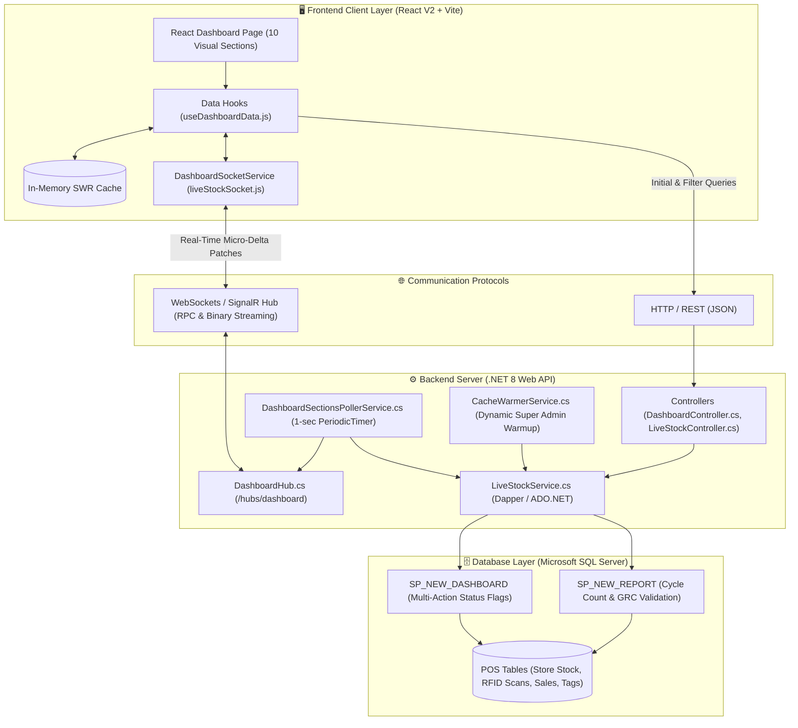

# 📚 Vishal Mega Mart (VMM) POS Dashboard V2 — Architecture & Engineering Documentation

Welcome to the central documentation hub for **POS Web Application React V2**. This folder (`md/`) contains comprehensive architectural guides, problem post-mortems, technology comparisons, question-and-answer deep dives, and beginner-friendly syntax tutorials explaining every facet of how this enterprise retail dashboard was engineered.

---

## 🗺️ Documentation Directory

| Document | Title | Description | Target Audience |
| :--- | :--- | :--- | :--- |
| [**`01_PROBLEMS_AND_SOLUTIONS.md`**](./01_PROBLEMS_AND_SOLUTIONS.md) | **Problems, Attempted Approaches & Solutions** | Deep-dive post-mortem of every major bug and layout hurdle encountered (Recharts 0px collapse, shimmer re-fetching, missing dropdowns, SQL casing, empty states), how many ways were attempted, and the working solution with **Mermaid flowcharts**. | All Developers, Architects |
| [**`02_CHALLENGES_AND_FAQ.md`**](./02_CHALLENGES_AND_FAQ.md) | **Architectural Challenges & Tech Q&A** | Comprehensive Q&A answering why specific technologies were chosen over alternatives (React vs Vanilla vs Next.js, Recharts vs D3/Chart.js, SignalR vs Polling), hardest challenges, and project constraints. | Tech Leads, Developers, Interviewers |
| [**`03_WEBSOCKETS_AND_SIGNALR_GUIDE.md`**](./03_WEBSOCKETS_AND_SIGNALR_GUIDE.md) | **End-to-End WebSockets & SignalR Guide** | Line-by-line syntax explanation of real-time communication from C# backend background services to React frontend state. Written so even a beginner HTML/CSS/JS developer can master it. | Frontend & Backend Developers |
| [**`04_FRONTEND_COMPONENTS_AND_SYNTAX.md`**](./04_FRONTEND_COMPONENTS_AND_SYNTAX.md) | **Frontend Architecture & Component Handbook** | Guide to the V2 UI Design System: the 3-Row pattern, reusable chart widgets, pure-CSS custom dropdowns, flexbox constraint rules, and animation systems. | Frontend Developers, UI Designers |
| [**`05_REACT_HOOKS_MASTERCLASS.md`**](./05_REACT_HOOKS_MASTERCLASS.md) | **React Hooks Masterclass** | Every React hook used in the project (`useState`, `useEffect`, `useCallback`, `useMemo`, `useRef`, custom hooks) explained with **actual production code examples** from the VMM codebase. | Beginners, Frontend Developers |
| [**`06_PROJECT_FILE_MAP.md`**](./06_PROJECT_FILE_MAP.md) | **Complete Project File Map** | Every single file and folder in the entire project explained — frontend components, backend services, hooks, context, pages, and CSS. | New Developers, Onboarding |
| [**`07_CSS_ANIMATIONS_AND_MICROINTERACTIONS.md`**](./07_CSS_ANIMATIONS_AND_MICROINTERACTIONS.md) | **CSS Animations & Micro-Interactions** | How shimmer loaders, live number tickers, row highlight flashes, connection status pills, dropdown transitions, and chart entry animations work, with full CSS `@keyframes` code. | Frontend Developers, UI Designers |

---

## 🏛️ High-Level System Architecture

The VMM Dashboard V2 is an **enterprise executive and operational dashboard** that visualizes retail inventory, store GRN validations, cycle counts, point-of-sale activities, warehouse tagging, and vendor discrepancies across 100+ hypermarket stores in real time.

---

## ⚡ Core Operational Principles

1. **V1 vs V2 Distinct Roles**:
   * **V1 (`POS_Web_Application React`)**: Strict 1:1 tabular replication of legacy ASP.NET WebForms. Optimized for high-density data entry and report printing.
   * **V2 (`POS_Web_Application React V2`)**: Modern executive visual dashboard. Replaces massive tables with KPI cards, semi-donuts, stacked and grouped bar charts, live status badges, and instant drill-downs.

2. **Real-Time Without Flooding**:
   * The backend does **not** push entire database tables over WebSockets.
   * Background services calculate **micro-deltas** (only the rows that changed plus summary counter updates) and broadcast small, targeted JSON patches to connected clients.

3. **Sub-second Perceived Performance**:
   * Initial page loads utilize **SWR (Stale-While-Revalidate)** caching. Navigating between Dashboard and Report views never displays blank shimmer loaders. Data renders at **0ms** from RAM, while fresh updates sync silently in the background.

---

## 🚀 How to Navigate This Documentation

* If you are troubleshooting a bug or wondering why code was written a specific way, read [**`01_PROBLEMS_AND_SOLUTIONS.md`**](./01_PROBLEMS_AND_SOLUTIONS.md).
* If you want to understand architectural trade-offs, technology choices, or prepare for technical reviews, read [**`02_CHALLENGES_AND_FAQ.md`**](./02_CHALLENGES_AND_FAQ.md).
* If you want to understand how WebSockets and SignalR work with step-by-step code tutorials, read [**`03_WEBSOCKETS_AND_SIGNALR_GUIDE.md`**](./03_WEBSOCKETS_AND_SIGNALR_GUIDE.md).
* If you need to build or modify UI components, charts, and CSS layouts, read [**`04_FRONTEND_COMPONENTS_AND_SYNTAX.md`**](./04_FRONTEND_COMPONENTS_AND_SYNTAX.md).
